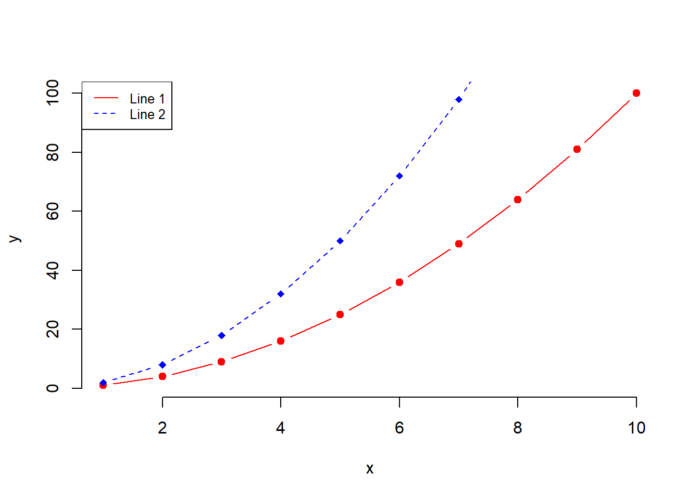
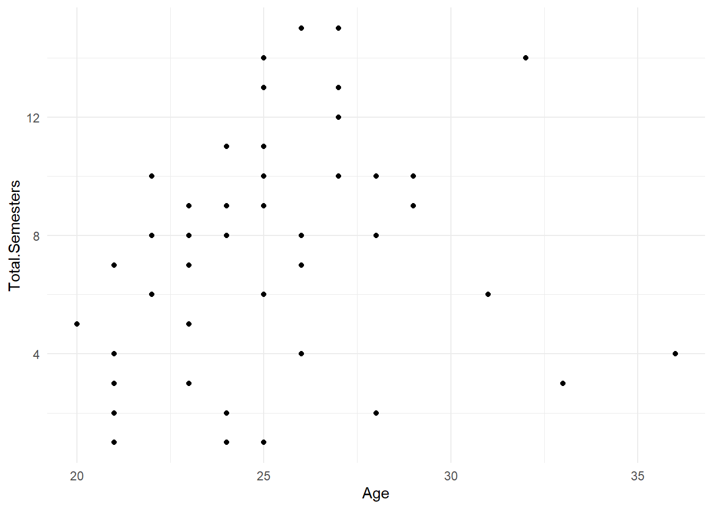
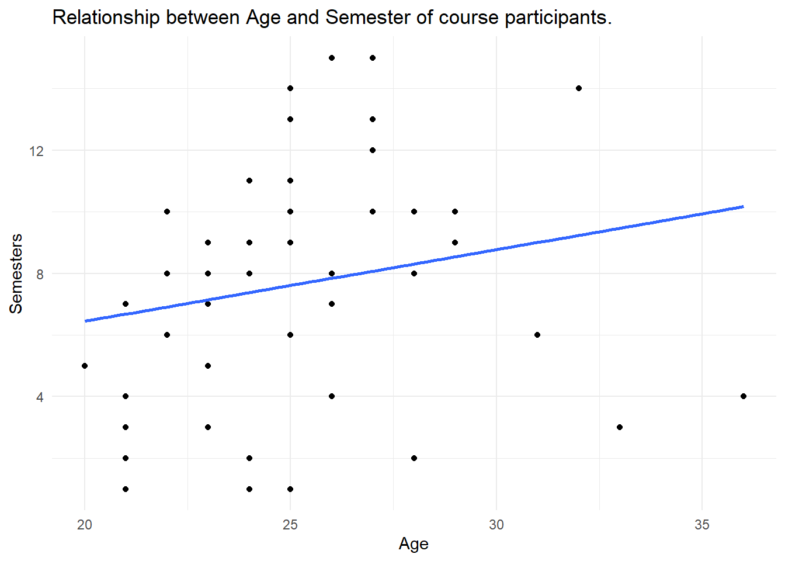

<!-- GENERATED FILE: DO NOT EDIT DIRECTLY -->
<!-- Edit the three L00 source files and rerun: -->
<!-- source("scripts/build-software-chapter.R") -->

# Software {-}

Data analysis in this book is carried out with code. The software chapter introduces the tools before the first substantive part of the book begins.

The aim is not to learn software for its own sake. R and the Tidyverse provide a transparent way to move between a question, the data, the calculation, and the result. Later software-related topics—such as projects, packages, reproducibility, and troubleshooting—can be added here without interrupting the substantive chapters.

## Why code? {-}

A point-and-click program can produce an answer. Code leaves a visible trail.

A script records how data were imported, cleaned, transformed, visualised, and analysed. It allows us to repeat the same steps, modify them, identify mistakes, and share the complete process with others.

This is one reason code fits the dolphin perspective so well. A graph or model summary gives us a view at the surface. The code allows us to dive into how that result was produced.

Using code supports:

- transparency;
- reproducibility;
- scalability;
- collaboration;
- documentation; and
- flexibility.


## Why R? {-}

This book uses `R`.

Many of its ideas could also be implemented in Python or other languages. The most important decision here is not that one language must defeat all others. It is the decision to work with an open programming language rather than relying exclusively on proprietary, point-and-click statistical software.

R is free and open source. It has a large community and a broad ecosystem for data preparation, visualisation, statistics, modelling, reporting, and teaching. The same environment can take us from raw data to a graph, a model, an interactive exercise, or an entire book.

This eBook is itself produced with R, R Markdown, and Bookdown.


## Why the Tidyverse? {-}

This book predominantly uses the `tidyverse`.

The tidyverse offers a relatively consistent and readable language for common data tasks. Functions such as `filter()`, `select()`, `mutate()`, and `summarise()` describe recognisable actions, while `ggplot2` builds visualisations from a systematic grammar.

This can lower the barrier at the surface. Beginners can often recognise what a sequence of code is trying to do before they understand every technical detail of R.

But the tidyverse is not the boundary of the ocean.

Base R, specialised packages, model-specific syntax, and mathematical notation will appear whenever they help answer the question at hand. The aim is not loyalty to one syntax. The aim is to use tools that make an analysis understandable, reliable, and useful.


<!-- The build script appends the existing Intro to R and Intro to Tidyverse files here as sections. -->

<!-- Possible future sections:
## Projects and file paths {-}
## Packages and reproducible environments {-}
## Troubleshooting {-}
-->


## Intro to R {-}
<!-- Comments start with one or multiple hash tags.  -->
<!-- http://seminars-in-applied-economics.de/wp-content/uploads/2020/08/SOEP_Practice_1.txt -->

An .R file is a **text document**. Open (and edit) it with a *text editor*, a *web browser* or a more sophisticated software like RStudio.^[Download RStudio <https://posit.co/downloads/>.] 

Click [this link](https://raw.githubusercontent.com/MarcoKuehne/marcokuehne.github.io/main/data/intro-r.R){target="_blank"} that opens an R script in your browser. 

Using .R files or scripts offers efficiency, reproducibility, scalability, collaboration, documentation, and flexibility. They allow you to automate tasks, handle large datasets, collaborate with others, document your work, and customize solutions.

<!-- https://raw.githubusercontent.com/MarcoKuehne/marcokuehne.github.io/main/data/intro-r.R -->
<!-- https://github.com/MarcoKuehne/marcokuehne.github.io/blob/main/data/intro-r.R -->
<!-- You can collapse sections in RStudio. -->

### R is a calculator {-}

<!-- By default, `tutorial` will convert all R chunks. -->
<!-- # ```{r, include=FALSE} -->
<!-- # tutorial::go_interactive(greedy=FALSE) -->
<!-- # ``` -->

R is a calculator. Use this R demo in the browser to explore basic features of R. Commands in the  **script.R** tab are executed by the **Run** bottom. It runs the entire script and prints out results in the **R Console**. This setting is simplified but reflects the procedure in a more complex integrated developer environment (IDE) like RStudio. <u id='intro_r'>Test it.</u> 

<iframe src="DCL/playground1.html" frameborder="0" scrolling="no" style="width:100%;height:360px"></iframe>


```{=html}
<span class="tippy html-widget html-fill-item" height="480" id="htmlwidget-641a0e9e62e143dba67a" width="672"></span>
<script type="application/json" data-for="htmlwidget-641a0e9e62e143dba67a">{"x":{"element":"intro_r","opts":{"content":"Delete all code, type 1:20 and hit Run."}},"evals":[],"jsHooks":[]}</script>
```

:::: {.defbox}
::: {.titeldefbox}
<h2> Definition </h2>
:::
Basic **arithmetic operators** are:

- `+` Addition
- `-` Subtraction 
- `*` Multiplication
- `/` Division
- `^` Exponent 
::::

<!-- https://cdn.datacamp.com/dcl-react-prod/index.html -->
<!-- <script src=https://cdn.datacamp.com/datacamp-light-latest.min.js></script> -->
<!-- <script type="text/javascript" src="//cdn.datacamp.com/dcl-react.js.gz"></script> -->
<!-- <iframe src="DCL/intro_1.html" frameborder="0" scrolling="no" style="width:100%;height:360px"></iframe> -->

### R is more than a calculator {-}

:::: {.challenge}
::: {.titelchallenge}
<h2> Your Turn: Adjust the code.</h2>
:::

If you never saw R before, change the `main` title  to what ever suits you or change the color option `col` from `lightblue` to `aliceblue`. 

If you have some experience, order the bars using the `sort()` command.

<iframe src="DCL/playground_graph.html" frameborder="0" scrolling="no" style="width:100%;height:360px"></iframe>
::::

<!-- rdrr.io is working but does not look nice -->
<!-- <iframe width='100%' height='500' src='https://rdrr.io/snippets/embed/' frameborder='1'></iframe> -->

### Define objects {-}

Define R objects for later use. Objects are **case-sensitive** (`X` is different from `x`). Objects can take any name, but its best to use something that makes sense to you, and will likely make sense to others who may read your code.

#### Numeric Variables {-}

The standard assignment operator is `<-`, the equal sign `=` works as well. The code assigns the object `a` the value 2 and `b` the value 3. The sum is 5. 


``` r
a <- 2
b = 3
a + b
## [1] 5
```

#### Logical Variables {-}

Logical values are `TRUE` and `FALSE`. Abbreviations work. You can write `T` instead of `TRUE`. 


``` r
> harvard               <-        TRUE # spacing doesn't matter
> yale      <- FALSE
> princeton <- F # short for FALSE
> 
> # Attention: FALSE=0, TRUE=1
> harvard + 1
```

```
## [1] 2
```

Although spacing technically doesn't matter in R, there are some  best practices to consider. 

> “Good coding style is like using correct punctuation. You can manage without it, but it sure makes things easier to read.”</b>
<footer class="blockquote-footer" style="text-align: right;">-- Hadley Wickam -- [Style guide](http://adv-r.had.co.nz/Style.html)</footer>

:::: {.reading}
::: {.titelreading}
<h2> Reading </h2>
:::
Place spaces around all binary operators (=, +, -, <-, etc.). Do not place a space before a comma, but always place one after a comma. 

Read more in [Google's R Style Guide](https://web.stanford.edu/class/cs109l/unrestricted/resources/google-style.html) at Uni Stanford.
::::

#### String Variables {-}

Text is stored as *string* or *character*.


``` r
emily  <- 'She is a friend.'     # string / character class / plain text
libby  <- "she is a coworker"    # use ' and " interchangeably
other  <- "people"               # prefer "
```

#### Factor Variables {-}

A factor is an ordered categorical variable. `c()` is a generic function which combines its arguments. 


``` r
fruit <- factor(c("banana", "apple")  ) # The default ordering is alphabetic
fruit
```

```
## [1] banana apple 
## Levels: apple banana
```

``` r
dose <- factor(c("low", "medium", "high")  ) # The default ordering is alphabetic
dose
```

```
## [1] low    medium high  
## Levels: high low medium
```

Factor levels inform about the order of the components, i.e. `apple` comes before `banana` and `high` comes comes before `low`, than comes `medium`. Of course, the apple-banana order does not makes any sense, and the high-low-medium order is just wrong. Software cannot know whether an ordering makes sense, that's job of the data scientist. Use the `levels` option inside the `factor()` function to tell R the ordering.


``` r
dose <- factor(c("low", "medium", "high"), levels = c("low", "medium", "high") ) 
dose
```

```
## [1] low    medium high  
## Levels: low medium high
```

#### Combine objects {-}


``` r
# Declare new objects using other variables
c <- a + b + 10

# Open z object or put everything in parentheses
(c <- a + b + 10)
```

```
## [1] 15
```

#### Vectors {-}

Think of a vector as a single column in a spreadsheet.


``` r
vectorA <- c(1,2,b)
vectorB <- c(TRUE,TRUE,FALSE)
vectorC <- c(emily, libby, other) 

# Vector Operations
vectorA - vectorB # Vector operation AND auto-change TRUE =1, FALSE=0
```

```
## [1] 0 1 3
```

#### Data frame {-}


``` r
# think of it conceptually like a spreadsheet
dataDF <- data.frame(numberVec    = vectorA,
                     trueFalseVec = vectorB,
                     stringsVec   = vectorC)

# Examine an entire data frame  
dataDF
```

```
##   numberVec trueFalseVec        stringsVec
## 1         1         TRUE  She is a friend.
## 2         2         TRUE she is a coworker
## 3         3        FALSE            people
```


``` r
# Declare a new column
dataDF$NewCol <- c(10,9,8)

# Examine with new column
dataDF
```

```
##   numberVec trueFalseVec        stringsVec NewCol
## 1         1         TRUE  She is a friend.     10
## 2         2         TRUE she is a coworker      9
## 3         3        FALSE            people      8
```

``` r
# Examine a single column
dataDF$numberVec # by name
```

```
## [1] 1 2 3
```

``` r
dataDF[,1] # by index...remember ROWS then COLUMNS
```

```
## [1] 1 2 3
```

``` r
# Examine a single row
dataDF[2,] # by index position
```

```
##   numberVec trueFalseVec        stringsVec NewCol
## 2         2         TRUE she is a coworker      9
```

``` r
# Examine a single value
dataDF$numberVec[2] # column name, then position (2)
```

```
## [1] 2
```

``` r
dataDF[1,2] #by index row 1, column 2
```

```
## [1] TRUE
```

### Plots {-}

There are *base R* graphs. There are `ggplot2` plots. 


``` r
# Create some variables
x <- 1:10
y1 <- x*x
y2  <- 2*y1

# Create a first line
plot(x, y1, type = "b", frame = FALSE, pch = 19, 
     col = "red", xlab = "x", ylab = "y")
# Add a second line
lines(x, y2, pch = 18, col = "blue", type = "b", lty = 2)
# Add a legend to the plot
legend("topleft", legend=c("Line 1", "Line 2"),
       col=c("red", "blue"), lty = 1:2, cex=0.8)
```




## Intro to Tidyverse {-}

The `tidyverse` is a collection of R packages for data science that share a common philosophy and grammar.^[See <https://www.tidyverse.org/>.] Once the package `tidyverse` is installed on your system via the command `install.packages(tidyverse)`, it is loaded via `library(tidyverse)` in a session. Then you have access to all components like `readr` (for reading data), `dplyr` (for manipulating data), `ggplot2` (for data visualization) and many more. 

### Data with readr {-}

The `readr` package reads data into what is called a *tibble*. 

A tibble is similar to a dataframe. When you print a tibble, it only shows the first ten rows and all the columns that fit on one screen. It also prints an abbreviated description of the column type, and uses font styles and color for highlighting. So to say, the default behavior is excellent.


``` r
# load the entire tidyverse
library(tidyverse)
```

```
## ── Attaching core tidyverse packages ──────────────────────── tidyverse 2.0.0 ──
## ✔ dplyr     1.2.1     ✔ readr     2.2.0
## ✔ forcats   1.0.1     ✔ stringr   1.6.0
## ✔ ggplot2   4.0.3     ✔ tibble    3.3.1
## ✔ lubridate 1.9.5     ✔ tidyr     1.3.2
## ✔ purrr     1.2.2     
## ── Conflicts ────────────────────────────────────────── tidyverse_conflicts() ──
## ✖ dplyr::filter() masks stats::filter()
## ✖ dplyr::lag()    masks stats::lag()
## ℹ Use the conflicted package (<http://conflicted.r-lib.org/>) to force all conflicts to become errors
```

``` r
# read_csv is a tidyverse (readr) function
coursedata <- read_csv("https://raw.githubusercontent.com/MarcoKuehne/marcokuehne.github.io/main/data/Course/GF_2022_57.csv")
```

```
## Rows: 57 Columns: 8
## ── Column specification ────────────────────────────────────────────────────────
## Delimiter: ","
## chr (3): Academic.level, Gender, Expectations
## dbl (5): Age, Total.Semesters, Background.in.Statistics, Background.in.R, Ba...
## 
## ℹ Use `spec()` to retrieve the full column specification for this data.
## ℹ Specify the column types or set `show_col_types = FALSE` to quiet this message.
```

``` r
# print a tibble
coursedata
```

```
## # A tibble: 57 × 8
##    Academic.level Gender   Age Total.Semesters Background.in.Statistics
##    <chr>          <chr>  <dbl>           <dbl>                    <dbl>
##  1 Bachelor       Female    23               8                        2
##  2 Bachelor       Female    22              10                        4
##  3 Master         Male      23               9                        4
##  4 Master         Male      24               2                        3
##  5 Master         Male      27              10                        2
##  6 Master         Male      23               7                        3
##  7 Bachelor       Female    20               5                        2
##  8 Bachelor       Female    22               8                        2
##  9 Master         Male      27              13                        4
## 10 Master         Female    22              10                        4
## # ℹ 47 more rows
## # ℹ 3 more variables: Background.in.R <dbl>,
## #   Background.in.Academic.Writing <dbl>, Expectations <chr>
```

When you use the base R `read.csv()` instead, it reads data into a *dataframe*. When you print the dataframe, it displays all data at once (output not shown in the book). In order to show first entries, another command like `head()` is necessary.


``` r
# use base R utilities 
coursedata <- read.csv("https://raw.githubusercontent.com/MarcoKuehne/marcokuehne.github.io/main/data/Course/GF_2022_57.csv")

# print a dataframe (all data)
coursedata

# print first 6 observations of the data
head(coursedata)
```

:::: {.reading}
::: {.titelreading}
<h2> Reading </h2>
:::
There are three key differences between tibbles and data frames: printing, subsetting, and recycling rules. Read more about those difference in the [vignette of tibble](https://cran.r-project.org/web/packages/tibble/vignettes/tibble.html).
::::

### Verbs of dplyr {-}

The first verbs you learn for data inspection are `glimpse()`, `select()`, `arrange()` and `filter()`. Those are classic operators that you also find in Microsoft Excel (via clicking the correct menu options). 

#### Glimpse {-}

`glimpse()` tells the number of rows and columns, the first variable names, the class of the variables, i.e. `chr` for character (like text) or `int` for integer (like whole numbers). Another kind of variables are `dbl`, double, short for double-precision floating-point format.

This data set contains 57 rows (observations) and 9 columns (variables).  `glimpse()` also shows the first observations for each variable. 


``` r
glimpse(coursedata)
```

```
## Rows: 57
## Columns: 8
## $ Academic.level                 <chr> "Bachelor", "Bachelor", "Master", "Mast…
## $ Gender                         <chr> "Female", "Female", "Male", "Male", "Ma…
## $ Age                            <dbl> 23, 22, 23, 24, 27, 23, 20, 22, 27, 22,…
## $ Total.Semesters                <dbl> 8, 10, 9, 2, 10, 7, 5, 8, 13, 10, 8, 8,…
## $ Background.in.Statistics       <dbl> 2, 4, 4, 3, 2, 3, 2, 2, 4, 4, 2, 2, 2, …
## $ Background.in.R                <dbl> 2, 3, 2, 1, 1, 1, 3, 1, 4, 4, 1, 2, 2, …
## $ Background.in.Academic.Writing <dbl> 2, 2, 4, 3, 4, 2, 3, 2, 4, 3, 1, 2, 3, …
## $ Expectations                   <chr> "I want to be efficient in my knowledge…
```

#### Select {-}

Columns are selected by name or column index. Thus, the outcome of `select(coursedata, Gender, Age)` and `select(coursedata, 2, 3)` is identical.


``` r
select(coursedata, Gender, Age) 
```

```
## # A tibble: 57 × 2
##    Gender   Age
##    <chr>  <dbl>
##  1 Female    23
##  2 Female    22
##  3 Male      23
##  4 Male      24
##  5 Male      27
##  6 Male      23
##  7 Female    20
##  8 Female    22
##  9 Male      27
## 10 Female    22
## # ℹ 47 more rows
```

We can use a minus `-` to get rid of a column and leave the rest of the columns:


``` r
select(coursedata, -Total.Semesters, -Background.in.Statistics,
       -Background.in.R, -Background.in.Academic.Writing) 
```
  
#### Arrange {-}

Often we are interested in the maximum or minimum age, thus `arrange()` a numerical value. 


``` r
arrange(coursedata, Age) # from low to high Age
```

```
## # A tibble: 57 × 8
##    Academic.level Gender   Age Total.Semesters Background.in.Statistics
##    <chr>          <chr>  <dbl>           <dbl>                    <dbl>
##  1 Bachelor       Female    20               5                        2
##  2 Master         Female    21               7                        2
##  3 Bachelor       Male      21               2                        3
##  4 Bachelor       Female    21               4                        2
##  5 Bachelor       Female    21               3                        2
##  6 Bachelor       Male      21               1                        2
##  7 Bachelor       Female    21               1                        3
##  8 Bachelor       Female    22              10                        4
##  9 Bachelor       Female    22               8                        2
## 10 Master         Female    22              10                        4
## # ℹ 47 more rows
## # ℹ 3 more variables: Background.in.R <dbl>,
## #   Background.in.Academic.Writing <dbl>, Expectations <chr>
```

The default is from low to high values, the `desc()` options reverses the order.


``` r
arrange(coursedata, desc(Age)) # reverse 
```

#### Rename {-}

Sometimes default variables names are too long or too complicated, thus we like to `rename()` them. 


``` r
coursedata %>% 
  rename(Degree = Academic.level,
         Semesters = Total.Semesters)
```

```
## # A tibble: 57 × 8
##    Degree   Gender   Age Semesters Background.in.Statistics Background.in.R
##    <chr>    <chr>  <dbl>     <dbl>                    <dbl>           <dbl>
##  1 Bachelor Female    23         8                        2               2
##  2 Bachelor Female    22        10                        4               3
##  3 Master   Male      23         9                        4               2
##  4 Master   Male      24         2                        3               1
##  5 Master   Male      27        10                        2               1
##  6 Master   Male      23         7                        3               1
##  7 Bachelor Female    20         5                        2               3
##  8 Bachelor Female    22         8                        2               1
##  9 Master   Male      27        13                        4               4
## 10 Master   Female    22        10                        4               4
## # ℹ 47 more rows
## # ℹ 2 more variables: Background.in.Academic.Writing <dbl>, Expectations <chr>
```
This change is only temporarily and shown in the console output. In order to keep the new name of a variable, we can overwrite the old R object or create a new one. 


``` r
# overwrite the old dataframe 
coursedata <- coursedata %>% 
  rename(Degree = Academic.level,
         Semesters = Total.Semesters)
```

#### The pipe operator {-}

As in base R, we often like to combine commands, e.g. select the `Age` variable and sort its values. `dplyr` verbs can be nested as in base R. 


``` r
arrange(select(coursedata, Age), Age) 
```

But there is something else that is used in tidyverse logic, the so called **pipe operator** ` %>%` (percentage sign, relation larger than, another percentage sign). You can read this as "then, please do the following". 


``` r
coursedata %>%        # start with this data
  select(Age) %>%     # then select only the Age variable
  arrange(Age)        # then arrange the values
```

```
## # A tibble: 57 × 1
##      Age
##    <dbl>
##  1    20
##  2    21
##  3    21
##  4    21
##  5    21
##  6    21
##  7    21
##  8    22
##  9    22
## 10    22
## # ℹ 47 more rows
```

#### Filter {-}

It is reasonable to `filter()` specific values of variables. All filters use conditional expression based on relational operators.

:::: {.defbox}
::: {.titeldefbox}
<h2> Definition </h2>
:::
Use **relational operators** to build your filter: 

- `==` equal to
- `!=` not equal to
- `>` more or `<` less then 
::::

Here are some examples: 


``` r
# filter students who have more than 10 semesters in total
coursedata %>% filter(Total.Semesters > 10) 

# filter female students
coursedata %>% filter(Gender == "Female") 
```

Combinations of filters are possible via logical operators `&` (and) and `|` (or). We are looking for females who study in a master program.


``` r
coursedata %>%      
  filter(Gender == "Female" & Academic.level == "Master") 
```

```
## # A tibble: 12 × 8
##    Academic.level Gender   Age Total.Semesters Background.in.Statistics
##    <chr>          <chr>  <dbl>           <dbl>                    <dbl>
##  1 Master         Female    22              10                        4
##  2 Master         Female    21               7                        2
##  3 Master         Female    29               9                        3
##  4 Master         Female    23               8                        4
##  5 Master         Female    26               8                        2
##  6 Master         Female    25              10                        2
##  7 Master         Female    24              11                        1
##  8 Master         Female    25              10                        3
##  9 Master         Female    33               3                        1
## 10 Master         Female    25              14                        4
## 11 Master         Female    25              11                        3
## 12 Master         Female    26               4                        2
## # ℹ 3 more variables: Background.in.R <dbl>,
## #   Background.in.Academic.Writing <dbl>, Expectations <chr>
```

We are looking for females or anybody who reports more than 10 semesters. 

``` r
coursedata %>%      
  filter(Gender == "Female" | Total.Semesters > 10) 
```

```
## # A tibble: 33 × 8
##    Academic.level Gender   Age Total.Semesters Background.in.Statistics
##    <chr>          <chr>  <dbl>           <dbl>                    <dbl>
##  1 Bachelor       Female    23               8                        2
##  2 Bachelor       Female    22              10                        4
##  3 Bachelor       Female    20               5                        2
##  4 Bachelor       Female    22               8                        2
##  5 Master         Male      27              13                        4
##  6 Master         Female    22              10                        4
##  7 Bachelor       Female    22               8                        2
##  8 Master         Female    21               7                        2
##  9 Master         Male      27              15                        3
## 10 Master         Female    29               9                        3
## # ℹ 23 more rows
## # ℹ 3 more variables: Background.in.R <dbl>,
## #   Background.in.Academic.Writing <dbl>, Expectations <chr>
```

#### Mutate {-}

`mutate()` is the most frequent used command you will come across. It changes the data. We create a new variable `Background_Knowledge` by taking the average of the three background variables. All background variables have the same range from 1 to 5. 


``` r
coursedata %>%      
  mutate(Background_Knowledge = (Background.in.Statistics +
                                 Background.in.R + 
                                 Background.in.Academic.Writing)/3) %>% 
  select(Academic.level, Gender, Age, Background_Knowledge)
```

```
## # A tibble: 57 × 4
##    Academic.level Gender   Age Background_Knowledge
##    <chr>          <chr>  <dbl>                <dbl>
##  1 Bachelor       Female    23                 2   
##  2 Bachelor       Female    22                 3   
##  3 Master         Male      23                 3.33
##  4 Master         Male      24                 2.33
##  5 Master         Male      27                 2.33
##  6 Master         Male      23                 2   
##  7 Bachelor       Female    20                 2.67
##  8 Bachelor       Female    22                 1.67
##  9 Master         Male      27                 4   
## 10 Master         Female    22                 3.67
## # ℹ 47 more rows
```

#### Summarize {-}

Would you like to know the average age of course participants? It is 24.7192982 There are two ways in order to achieve this. 


``` r
# calculate mean age with mutate()
coursedata %>%      
  mutate(mean_age = mean(Age)) 

# calculate mean age with summarize() 
coursedata %>%      
  summarize(mean_age = mean(Age)) 
```

What is the difference between them? `mutate()` creates a new variable `mean_age` in the data set for all 57 observations. But there is only 1 mean value. Thus, `mutate()` repeats this mean value 57 times. The result is a 57x9 tibble. `summarize()` collapses the tibble to a single value. The result is a 1x1 tibble.

The question is, what do you plan to do next with your results. After `summarize()` all other information is gone. We will see this in the next graph. 

### Graphs with ggplot2 {-}

`ggplot()` follows the <u id='gg'>Grammar of Graphics</u>. The first argument is the data, the second is `aes()` aesthetics (that define the x- and y-variable). In order to add more to the graph, use the `+` operator (instead a pipe). Add layers, so called geoms, like `geom_point()` to create points in a coordinate system, a.k.a the scatter plot. `theme_minimal()` is a particular set of options that controls non-data display. 


```{=html}
<span class="tippy html-widget html-fill-item" height="480" id="htmlwidget-3076c8fc43ea1a3b1e7d" width="672"></span>
<script type="application/json" data-for="htmlwidget-3076c8fc43ea1a3b1e7d">{"x":{"element":"gg","opts":{"content":"By Leland Wilkinson."}},"evals":[],"jsHooks":[]}</script>
```


``` r
ggplot(coursedata, aes(x = Age, y = Total.Semesters)) + 
  geom_point() + 
  theme_minimal()
```



Alternatively, data can be piped into a `ggplot()`. In the second version of the graph, we added axis labels inside the `labs()` command and another layer `geom_smooth()` for a trend line of the relationship. Inside we define the `method` to be a linear model and the standard errors to be deactivated. Play around with those options, what other methods are available? What happens when we turn standard errors on? 


``` r
coursedata %>% 
  ggplot(aes(x = Age, y = Total.Semesters)) + 
  geom_point() + 
  geom_smooth(method = "lm", se = FALSE) + 
  theme_minimal() +
  labs(title = "Relationship between Age and Semester of course participants.", x = "Age", y = "Semesters")
```

```
## `geom_smooth()` using formula = 'y ~ x'
```




