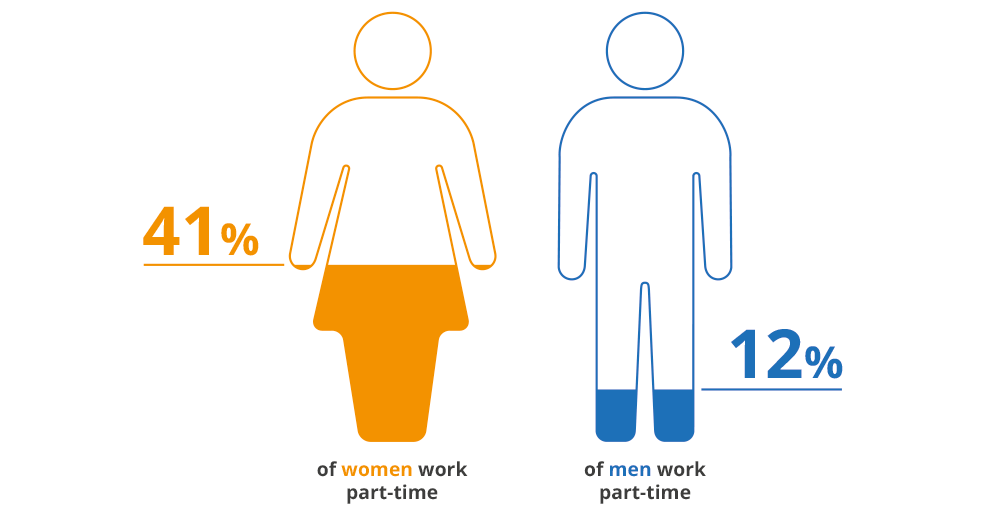

## Stories and Visuals

Stories make data and numbers memorable. Stories are everywhere. When you think about the context of the data, stories evolve naturally. How does the data connect to you, your friends and family, the work environment or society as a whole. 

### Facts 

A good story is based on facts and reliable sources. When evaluating facts, it's important to consider the source of the information and the evidence supporting it. According to OECD data on part-time employment rate (2021):^[Search OECD database <https://stats.oecd.org/index.aspx?queryid=54746#>]

> 36 % of women worked part-time in Germany whereas only 10 % of men did.

<!-- <iframe src="https://data.oecd.org/chart/72QZ" width="860" height="645" style="border: 0" mozallowfullscreen="true" webkitallowfullscreen="true" allowfullscreen="true"><a href="https://data.oecd.org/chart/72QZ" target="_blank">OECD Chart: Part-time employment rate, Total, % of employment, Annual, 2021</a></iframe> -->
<!-- https://www.oecd.org/gender/data/part-time-employment-by-sex.htm -->
<!-- > In 2021, the OECD total average part-time employment rate was 16.4 %. -->

### Visualization

Good data visualization helps to convey complex information in a way that is easily understandable and accessible to a wide range of people. By presenting data in a visually appealing and intuitive way, it can help people to identify patterns, trends, and relationships that might not be immediately apparent from a simple data table or text-based analysis. 

```{r, eval=T, echo=F, warning=FALSE, message=FALSE}
library(readxl)
parttime <- readxl::read_xlsx("./data/OECD/parttime_gender_easy.xlsx")

# Version 1
library(showtext)

female = intToUtf8(9792)
male = intToUtf8(9794)

library(tidyverse)
parttime %>% 
  filter(Year == 2021) %>% 
  #mutate(Sex = forcats::fct_infreq(Sex)) %>% 
  ggplot(aes(x = Sex, y = Percent, fill = Sex)) + 
  geom_col(width = 0.5) + 
  labs(title = "Share of employed in part-time employment, by sex (Germany)") + 
  theme_minimal() +
  ggplot2::annotate("text", x = 1, y = 5, label = male, size = 20) +
  ggplot2::annotate("text", x = 2, y = 25, label = female, size = 20) 

# Version 2 
# library("ggimage")
# 
# parttime %>% 
#   filter(Year == 2021) %>% 
#   mutate(image = c("https://raw.githubusercontent.com/ionic-team/ionicons/main/src/svg/male-outline.svg",
#               "https://raw.githubusercontent.com/ionic-team/ionicons/main/src/svg/female-outline.svg")) %>% 
#   ggplot(aes(x = Sex, y = Percent, fill = Sex)) + 
#   geom_col(width = 0.5) + 
#   geom_image(aes(image=image), size=.2, nudge_y = -4) + 
#   labs(title = "Share of employed in part-time employment, by sex (Germany)") + 
#   theme_minimal() 
```

Why not just tell the numbers as is? An important aspect of data science is to communicate information clearly and efficiently. Complex data is made more accessible. 

Data visualization reveals the data.

<!-- ```{r parttime, echo=FALSE, out.width="70%", fig.cap="\\label{fig:parttime}Possible gender difference in working parttime.", fig.align='center'} -->
<!--  -->
<!-- ``` -->

<!-- Figure \@ref(fig:parttime) illustrates a possible gender difference in working parttime. The iconic figures are simple. The coloring is decent. The gender icons are filled by color up to the percentage numbers.  -->

### Telling a story

<!-- https://clauswilke.com/dataviz/telling-a-story.html -->
<!-- https://informationisbeautiful.net/visualizations/best-in-show-whats-the-top-data-dog/ -->

Data storytelling is the practice of using data and visuals to communicate a narrative or message to an audience. It involves combining data, analysis, and storytelling techniques to create a compelling and engaging narrative that can inform, persuade, and inspire action. 

Data storytelling is necessary and good because it helps people make sense of complex data and information. By presenting data in a clear and visually appealing way, data storytelling can help people understand the meaning behind the numbers, identify patterns and trends, and gain insights into important issues and problems.

By weaving a compelling narrative around the data, we can help our audience to understand the insights that we have discovered and why they matter. A data story can also help to make the data more memorable and emotionally resonant, which can help to further engage our audience and increase their interest in the subject matter.

:::: {.amazing}
::: {.titelamazing}
<h2> Once upon a time ... </h2>
:::
in a land not too far away, there were two siblings named Alex and Jamie. Alex and Jamie were very close in age and grew up in the same household with the same parents, but they had very different personalities and interests.

As they reached adulthood, Alex decided to pursue a career in finance and secured a full-time job at a large investment bank. Jamie, on the other hand, decided to focus on their passion for art and took on a part-time job as a freelance graphic designer while also working on personal creative projects.

Over time, Alex and Jamie noticed a stark difference in the way their work and career choices were perceived by society. Alex was praised for their ambition and dedication to their career, while Jamie was often questioned or criticized for not having a full-time job with benefits and stability.

Alex was also more likely to receive promotions and higher salaries, while Jamie struggled to make ends meet and was sometimes overlooked for opportunities because of their part-time status.

It became clear to Alex and Jamie that there was a gendered expectation for men to pursue full-time, high-paying careers while women were expected to prioritize caregiving or creative pursuits over financial stability.

Despite these societal expectations, Alex and Jamie continued to pursue their individual paths and support each other's choices. They hoped that someday, society would recognize the value and importance of all types of work and careers, regardless of gender or perceived societal norms.
::::

### Man's best friend

Humans love dogs. Dogs were domesticated by humans over 15,000 years ago. They can be perfect companions for singles, for couples for families. They differ in behavior, longevity and appetite. Figure \@ref(fig:dogs) combines 6 dog characteristics in a *dog score* and compares this with the popularity of different breeds. From this scatterplot the authors define four categories of dog breads, e.g. the hot dogs and overlooked treasures (similar to a [BCG matrix](https://en.wikipedia.org/wiki/Growth%E2%80%93share_matrix)). 

```{r dogs, echo=FALSE, out.width="100%", fig.cap="The Ultimate Dog Data by [informationisbeautiful](https://informationisbeautiful.net/visualizations/best-in-show-whats-the-top-data-dog/).", fig.align='center'}
knitr::include_graphics("https://infobeautiful4.s3.amazonaws.com/2014/11/IIB_Best-In-Show_1276x2.png")
```

On the one hand, this is an awesome chart that transforms a huge data table in one graph, a scatter plot on two dimensions lightened by the individual dog icons for each data point. On the other hand, this graph is so complex and does not offer a major takeaway. Looking more closely to the graph, raises more questions then the graph answers, i.e. how was *grooming* and *appetite* measured? How are the 6 factors combined in the *data score*? When you look even more closely, you notice the easter egg.^[The frightened cat among all dogs.]

### Less is more

Figure \@ref(fig:dogs) is an awesome data aggregate. Still, "less is more" in data visualization, because visual clutter can overwhelm the audience and make it harder to see the key insight. The complex scatterplot demands a lot of attention.

Edward Tufte gave this intuition a name.[^stories-tufte]

:::: {.defbox}
::: {.titeldefbox}
<h2> Definition </h2>
:::
The **data-ink ratio** is the proportion of the ink in a graphic that presents actual data, relative to the total ink used.

Tufte's prescription follows from it: show the data, maximise the data-ink ratio, and erase non-data ink.
::::

Most charts fail this test not because anybody decided to clutter them, but because the software defaults did it for them. Below is one chart — the number of participants in seven terms of this course — taken apart one element at a time.

**Drag the slider, or click it and use the arrow keys.** Twenty-two steps. Nothing is ever added except at step 17.

```{r ink-slider, echo=FALSE, warning=FALSE, message=FALSE, results='asis'}
library(tidyverse)

counts <- read.csv(paste0("https://raw.githubusercontent.com/MarcoKuehne/",
                          "marcokuehne.github.io/main/data/Course/GF_AllTime.csv"),
                   sep = ";") %>%
  count(Term, name = "Students")

short <- sub("^SS (\\d{4})$", "S\\1",
             sub("^WS (\\d{4}) \\d{4}$", "W\\1", counts$Term))

state <- list(frame = TRUE, plotbg = TRUE, panelbg = TRUE, minor = TRUE,
              gridcol = "black", vgrid = TRUE, hgrid = TRUE, border = TRUE,
              multicol = TRUE, legend = TRUE, xtitle = TRUE, bold = TRUE,
              ticks = TRUE, wide = TRUE, dark = TRUE, labels = FALSE,
              ytext = TRUE, ytitle = TRUE, axisline = TRUE,
              longnames = TRUE, rotate = TRUE)

draw <- function(s, caption) {
  d <- counts
  d$Lab <- factor(if (s$longnames) d$Term else short,
                  levels = if (s$longnames) d$Term else short)
  p <- ggplot(d, aes(x = Lab, y = Students))
  p <- p + if (s$multicol) {
    geom_col(aes(fill = Lab), colour = if (s$border) "black" else NA,
             linewidth = if (s$border) 1 else 0, width = if (s$wide) .9 else .65)
  } else {
    geom_col(fill = if (s$dark) "grey35" else "grey65",
             colour = if (s$border) "black" else NA,
             linewidth = if (s$border) 1 else 0, width = if (s$wide) .9 else .65)
  }
  if (s$labels) {
    p <- p + geom_text(aes(label = Students), vjust = -0.5, size = 3, colour = "grey20")
  }
  p + labs(title = "Course participants per term", subtitle = caption,
           x = if (s$xtitle) "Term" else NULL,
           y = if (s$ytitle) "Number of Students" else NULL) +
    theme_grey(base_size = 10) +
    theme(
      plot.background = if (s$plotbg) {
        element_rect(fill = "grey95", colour = if (s$frame) "black" else NA,
                     linewidth = if (s$frame) 2 else 0)
      } else element_blank(),
      panel.background = if (s$panelbg) element_rect(fill = "grey80") else element_blank(),
      panel.grid.minor = if (s$minor) element_line(colour = s$gridcol, linewidth = .3) else element_blank(),
      panel.grid.major.x = if (s$vgrid) element_line(colour = s$gridcol, linewidth = .6) else element_blank(),
      panel.grid.major.y = if (s$hgrid) element_line(colour = s$gridcol, linewidth = .6) else element_blank(),
      axis.line.y = if (s$axisline) element_line(colour = "grey40") else element_blank(),
      axis.ticks  = if (s$ticks) element_line() else element_blank(),
      axis.title  = if (s$bold) element_text(face = "bold") else element_text(),
      axis.text.y = if (s$ytext) element_text() else element_blank(),
      axis.text.x = element_text(angle = if (s$rotate) 45 else 0,
                                 hjust = if (s$rotate) 1 else .5,
                                 face = if (s$bold) "bold" else "plain"),
      legend.position = if (s$legend) "right" else "none",
      plot.subtitle = element_text(size = 8, colour = "grey30"))
}

steps <- list(
  c(NA,          "everything the defaults offer"),
  c("frame",     "outer frame removed"),
  c("plotbg",    "page background removed"),
  c("panelbg",   "panel background removed"),
  c("minor",     "minor gridlines removed"),
  c("gridcol",   "gridlines lightened"),
  c("vgrid",     "vertical gridlines removed - the bars already mark the categories"),
  c("hgrid",     "horizontal gridlines removed"),
  c("border",    "bar outlines removed"),
  c("multicol",  "colour removed - it encoded nothing the axis did not"),
  c("legend",    "legend removed - it repeated the axis labels"),
  c("xtitle",    "axis title removed - the labels already say it"),
  c("bold",      "bold removed"),
  c("ticks",     "tick marks removed"),
  c("wide",      "bars narrowed"),
  c("dark",      "fill lightened"),
  c("labels",    "numbers ADDED - ink spent to gain information"),
  c("ytext",     "y axis text removed - now redundant"),
  c("ytitle",    "y axis title removed"),
  c("axisline",  "axis line removed"),
  c("longnames", "labels shortened"),
  c("rotate",    "labels set horizontal"))

# Each frame is embedded directly in the page, so no file paths can break.
tmp <- tempfile(fileext = ".png")
s <- state
uris <- character(length(steps))
for (i in seq_along(steps)) {
  key <- steps[[i]][1]
  if (!is.na(key)) {
    s[[key]] <- if (key == "gridcol") "grey85" else if (key == "labels") TRUE else FALSE
  }
  ggsave(tmp, draw(s, sprintf("step %d of %d - %s", i, length(steps), steps[[i]][2])),
         width = 6, height = 3.8, dpi = 90, bg = "white")
  uris[i] <- knitr::image_uri(tmp)
}

cat('<div style="margin:1.5rem 0;">\n',
    '\n',
    '<input type="range" id="inkSlider" min="1" max="', length(steps),
    '" value="1" step="1" style="width:100%;margin-top:.6rem;">\n</div>\n',
    '<script>\nvar inkFrames = ["', paste(uris, collapse = '","'), '"];\n',
    '(function(){var i=document.getElementById("inkImg"),s=document.getElementById("inkSlider");',
    's.addEventListener("input",function(){i.src=inkFrames[+s.value-1];});})();\n</script>\n',
    sep = "")
```

Nothing was added between step 1 and step 22 except the numbers at step 17. Everything else was taken away: a frame, two background fills, two sets of gridlines, bar outlines, seven colours that encoded nothing the axis did not already say, a legend that repeated those labels a second time, an axis title, bold type, tick marks, and finally the y-axis itself.

#### What the ink is worth {#stories-measuring-ink}

Data-ink is usually discussed as a metaphor. It does not have to be one. Save each chart as an image and count the pixels that are not white, and you have a measure of how much ink the graphic actually spends.

| Step | | Ink (pixels) | Reduction |
|---:|---|---:|---:|
| 1 | everything the defaults offer | 307,390 | — |
| 4 | backgrounds removed | 98,264 | 68 % |
| 11 | colour and legend removed | 99,825 | 68 % |
| 22 | data and labels only | 93,383 | **70 %** |

The final chart spends **70 % less ink than the first and carries exactly the same seven numbers**. Two-thirds of the original was decoration, and most of it vanished in the first four steps.

Notice, though, that step 11 uses slightly *more* ink than step 4 even while looking cleaner. Dropping the legend gave the panel more room, so the bars grew. Ink is a proxy, not a goal.

::: {.analysis-note}
Tufte was writing in 1983, about paper, when the metaphor was almost literal. So let us take it literally and see what it is worth.

A six-by-nine-inch page is about 0.035 m². Offset printing lays down an ink film of roughly one micrometre, which works out to around 1.2 grams per square metre at full coverage, and black offset ink costs on the order of ten to fifteen euros per kilogram. Replacing one bar chart with a version that spends 14 percentage points less ink therefore saves about **0.0013 grams per copy**.

For a 500-copy academic monograph that is roughly **one cent** — for every chart in the book. For a 50,000-copy bestseller, under **one euro**.

These are order-of-magnitude estimates, and the direction is what matters: **the data-ink ratio cannot be defended on economic grounds.** On paper it is worth cents. On a screen, ink is free and the saving is exactly zero.
:::

So the principle has to be re-founded, and the foundation is not economics but attention. Every element on a chart competes for a reader who will give the graphic a few seconds. Non-data ink does not cost money; it costs the reader's limited capacity to find the thing you drew the chart to show.

That reframing has a consequence, and it is the rule for the rest of this chapter:

> **Message before design. Design only where it helps understanding.**

### Never use pie charts

The data-ink argument is about what a graphic spends. There is a second question, and it is about what the human eye can actually do.

```{r pie-data}
x      <- c(14, 62, 17, 53)
labels <- c("London", "New York", "Singapore", "Mumbai")
```

**One question: is the share for Singapore larger or smaller than the share for London?**

```{r pie-chart, echo=FALSE, fig.align='center', fig.width=5.2, fig.height=3.8}
par(mar = c(0, 2, 0, 2), xpd = TRUE)
pie(x, labels, radius = 1, col = grey(c(.85, .55, .75, .65)), border = "white")
```

Take a moment before you scroll.

<details>
<summary>**Can you tell now?**</summary>

```{r pie-bar, echo=FALSE, fig.align='center', fig.width=5.2, fig.height=3.4}
par(mar = c(3, 3.5, 1, 1), mgp = c(2, .6, 0))
barplot(x, names.arg = labels, col = "grey65", border = NA, las = 1)
```

</details>

Both charts show the same four numbers. The second answers the question instantly; the first requires guessing. The reason is perceptual rather than aesthetic. A pie chart asks you to compare **angles and areas**; a bar chart asks you to compare **positions and lengths along a common scale**.

Cleveland and McGill measured this. In their experiments, position judgements were about **twice as accurate** as angle judgements, and **88 % of the large errors** occurred on the angle task.[^stories-cleveland] They proposed a ranking of perceptual tasks by accuracy, with position along a common scale at the top and area, volume, shading and colour saturation at the bottom.[^stories-ranking]

R's own documentation is blunter. The help page for `pie()` states: *"Pie charts are a very bad way of displaying information."*

:::: {.amazing}
::: {.titelamazing}
<h2> When a pie chart is defensible </h2>
:::
Two or three slices, one obviously dominant, and the point being *part of a whole* rather than a comparison between parts.

Recent experimental work is gentler than the folklore: pies, donuts and bars performed **equally well for extracting part–whole relationships**, and where differences appeared they were often small. Bars won on *ranking* tasks and were faster overall.[^stories-hill]

So the rule is not "pie charts are evil." It is: **the moment a reader has to rank the slices, a bar chart wins.**
::::

### Then why use bars at all? {#stories-bars}

Follow the argument to its end and it turns on the bar chart itself.

A bar spends a great deal of ink to place one number. It draws a filled rectangle from zero to the value, when only the *tip* carries information. Everything below the tip is a container. If position along a common scale is what the eye reads well, a single dot at the same height would do the same job for a fraction of the ink — which is exactly what Cleveland proposed with the **dot plot**.[^stories-dotplot]

And the container is not free. Shown a bar representing a mean, readers judge data points **inside** the bar as more likely than points equally far from the mean but **outside** it — as though the bar contained the data.[^stories-withinbar] The effect replicates across labs and, disturbingly, gets *stronger* among readers with higher graph literacy.[^stories-okan] A later study using drawing rather than rating suggests the mechanism is narrower than first thought: about **one reader in five** makes a categorical error, reading a mean bar as if it were a count bar with the data capped at the tip.[^stories-btl]

Meanwhile a survey of 703 physiology papers found that **85.6 % contained at least one bar graph**, and of those, three-quarters showed mean ± standard error — a display in which wildly different distributions produce identical pictures.[^stories-weissgerber]

So: technically we could plot almost anything. Empirically, people mostly plot bars. What lies between?

Three things are worth holding on to before deleting every bar you own.

**Bars carry the zero.** A bar is dishonest if its axis is truncated, in a way a dot plot is not — but that is because the bar *insists* on the baseline. Dot plots relinquish that discipline, and truncating an axis biases judgement in any encoding, with or without visual cues warning the reader.[^stories-truncation]

**Bars mean "compare these separate things."** Readers reliably associate bars with discrete comparisons and lines with trends, and this correspondence appears without anyone being taught it.[^stories-zacks] For seven separate terms, a bar is doing something a dot cannot: saying *these are categories, not a series*.

**Familiarity is real, and small.** The conventional vertical bar is identified faster than horizontal bars or lines — by roughly 35 to 55 milliseconds.[^stories-typicality] That is an advantage in recognition speed, not in accuracy of reading values, and it should not be inflated into a defence of bars for every purpose.

::: {.analysis-takeaway}
**Technically possible:** almost any encoding, animated, interactive, three-dimensional.

**Actually used:** bars and pies, because that is what spreadsheets offer and what audiences have learned to read. Across a large collection of web charts, bar share ranged from 12 % to 57 % depending only on *which tool* made them.[^stories-usage]

**The defensible middle:** use the most conventional form that supports the specific judgement your reader has to make. Bars for comparing separate categories with a meaningful zero. Dots when the zero is not meaningful, when the labels are long, or when many series must be compared. Lines for trends. And in every case, spend the ink you saved on the one thing that helps most — **putting the message in the title** and labelling the data directly, so the reader does not have to translate a legend before they can think.
:::

:::: {.challenge}
::: {.titelchallenge}
<h2> Your Turn </h2>
:::
Look back at step 22 of the slider. Would a dot plot be better than those bars for the seven terms? `r mcq(c("Yes, less ink is always better", answer = "No, the terms are separate categories and zero is meaningful", "It makes no difference"))`

Now change the chart's title from "Course participants per term" to whatever you think the chart actually shows. Which change improved the graphic more — the twenty-two removals, or the title?
::::

[^stories-tufte]: Tufte, E. R., *The Visual Display of Quantitative Information*, 2nd edition, Graphics Press, 2001 (first edition 1983). The data-ink ratio is developed in Chapter 4.

[^stories-cleveland]: Cleveland, W. S., and McGill, R., *Graphical Perception: Theory, Experimentation, and Application to the Development of Graphical Methods*, *Journal of the American Statistical Association* 79(387), 1984, 531--554, <https://doi.org/10.1080/01621459.1984.10478080>.

[^stories-ranking]: Cleveland and McGill's own ranking leaves several tasks tied, including length, direction and angle. The familiar tie-free ordering (position, length, angle, slope, area, volume, colour) is Mackinlay's adaptation: Mackinlay, J. D., *Automating the Design of Graphical Presentations of Relational Information*, *ACM Transactions on Graphics* 5(2), 1986, 110--141.

[^stories-hill]: Hill, A., *Are pie charts evil? An assessment of the value of pie and donut charts compared to bar charts*, *Information Visualization*, 2025, <https://doi.org/10.1177/14738716241259432>.

[^stories-dotplot]: Cleveland, W. S., *Graphical Methods for Data Presentation: Full Scale Breaks, Dot Charts, and Multibased Logging*, *The American Statistician* 38(4), 1984, 270--280. Developed further in *The Elements of Graphing Data*, Wadsworth, 1985.

[^stories-withinbar]: Newman, G. E., and Scholl, B. J., *Bar graphs depicting averages are perceptually misinterpreted: The within-the-bar bias*, *Psychonomic Bulletin & Review* 19(4), 2012, 601--607, <https://doi.org/10.3758/s13423-012-0247-5>.

[^stories-okan]: Okan, Y., Garcia-Retamero, R., Cokely, E. T., and Maldonado, A., *Biasing and debiasing health decisions with bar graphs*, *Quarterly Journal of Experimental Psychology* 71(12), 2018, 2506--2519. The bias changed treatment choices, and higher graph literacy predicted a *stronger* effect.

[^stories-btl]: Kerns, S. H., and Wilmer, J. B., *Two graphs walk into a bar: Readout-based measurement reveals the Bar-Tip Limit error*, *Journal of Vision* 21(12):17, 2021, <https://doi.org/10.1167/jov.21.12.17>. Prevalence 22.1 %, 95 % CI [18.9, 25.8].

[^stories-weissgerber]: Weissgerber, T. L., Milic, N. M., Winham, S. J., and Garovic, V. D., *Beyond Bar and Line Graphs: Time for a New Data Presentation Paradigm*, *PLOS Biology* 13(4), 2015, e1002128. Survey of 703 articles in the top quartile of physiology journals, first quarter of 2014.

[^stories-truncation]: Correll, M., Bertini, E., and Franconeri, S., *Truncating the Y-Axis: Threat or Menace?*, *Proceedings of CHI 2020*, <https://doi.org/10.1145/3313831.3376222>.

[^stories-zacks]: Zacks, J., and Tversky, B., *Bars and lines: A study of graphic communication*, *Memory & Cognition* 27(6), 1999, 1073--1079.

[^stories-typicality]: Reimann, D., Struwe, M., Ram, N., and Gaschler, R., *Typicality effect in data graphs*, *Visual Communication* 24(1), 2025, 114--128. Vertical bars were identified in about 720 ms, horizontal bars 757 ms, lines 773 ms.

[^stories-usage]: Battle, L., Duan, P., Miranda, Z., Mukusheva, D., Chang, R., and Stonebraker, M., *Beagle: Automated Extraction and Interpretation of Visualizations from the Web*, *Proceedings of CHI 2018*. Over 42,000 charts; four types — bar, line, scatter and map — account for 65 % to 90 % of each collection.
