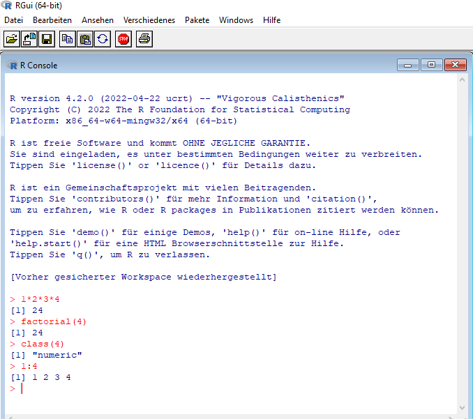

# Software is everywhere 

<!-- https://towardsdatascience.com/comparison-of-data-analysis-tools-excel-r-python-and-bi-tools-6c4685a8ea6f -->
<!-- https://blog.devgenius.io/why-r-not-excel-not-python-3ffd7668f854 -->
<!-- https://r4stats.wordpress.com/articles/popularity/ -->

> "The Zen of Organization is not to be found in Fancy Software."
>
> `r tufte::quote_footer('--- Kieran Healy. 2019. ')`

Data is inseparable from software.^[Check the [category of data analysis software](https://en.wikipedia.org/wiki/Category:Data_analysis_software) and the [list of statistical software](https://en.wikipedia.org/wiki/List_of_statistical_software).] Data comes in various file formats that are connected to a specific software. Although most software can handle most of the common file formats. So, if almost all software can handle almost all data, how should we choose one? 

When choosing a software for data analysis there are many factors to consider:^[Check out the versatile discussion on the measurement of data analysis software popularity by Robert München: [The Popularity of Data Analysis Software](https://r4stats.wordpress.com/articles/popularity/)]

- Does it run on your computer?
- Can you afford it? 
- Do your colleagues use it? 
- Does the software provide all the methods you need? 

:::: {.reading}
::: {.titelreading}
<h2> Reading </h2>
:::
Kieran Healy (2019): [The Plain Person’s Guide to Plain Text Social Science](https://plain-text.co/)
::::

## Software 

Irrespective of the software, how to talk with it? 

### Command line interface (CLI)

A command-line interpreter or command-line processor uses a **command-line interface (CLI)** to receive commands from a user in the form of lines of text. 

To open up the command prompt (on Windows), just press the windows key and search for `cmd`. When R is installed, it comes with a utility called `Rscript`. This allows you to run R commands from the command line.

If `Rscript` is in your `PATH`, then typing Rscript into the command line, and pressing enter, will not result in an error. Otherwise, you might get a message saying “‘Rscript’ is not recognized as an internal or external command.” If that’s the case, then to use Rscript, you will either need to add it to your PATH (as an environment variable), or append the full directory of the location of Rscript on your machine. To find the full directory, search for where R is installed your computer. 

```{r , echo=FALSE, out.width="90%", fig.cap="\\label{fig:CLI} Command Line Interface on Windows with R", fig.align='center'}
#url <- "https://info201.github.io/img/r-intro/r-interactive-session.png"
knitr::include_graphics("images/R_CLI.png")
```

The above example runs the commands

```{r echo = T, eval = F}
1*2*3*4
factorial(4)
class(4)
1:4
```

<!-- https://www.r-bloggers.com/2018/10/how-to-run-r-from-the-task-scheduler/ -->

### Graphical user interface (GUI)

The **GUI, graphical user interface**, is a form of user interface that allows users to interact with electronic devices through graphical icons and audio indicator such as primary notation, instead of text-based UIs, typed command labels or text navigation. GUIs were introduced in reaction to the perceived steep learning curve of CLIs (command-line interfaces), which require commands to be typed on a computer keyboard. 

```{r , echo=FALSE, out.width="80%", fig.cap="\\label{fig:GUI} RGui on Windows. Feels like no GUI.", fig.align='center'}
#url <- "https://info201.github.io/img/r-intro/r-interactive-session.png"

```

When you can click `File -> Open`, you are on a GUI. 

### Integrated development environment (IDE)

RStudio is an **integrated development environment (IDE)** for R. 

>"The RStudio IDE is a set of integrated tools designed to help you be more productive with R and Python. It includes a console, syntax-highlighting editor that supports direct code execution, and a variety of robust tools for plotting, viewing history, debugging and managing your workspace." [RStudio](https://www.rstudio.com/products/rstudio/download/)</b>

<!-- https://teacherscollege.screenstepslive.com/a/1426910-panes-in-rstudio -->

RStudio comes with four panes 

1. Source Editor (open, edit and execute R code)
2. Console (type and execute R code, it is like the command line)
3. Environment (shows objects)
4. Misc tabs (file manager, plots, package manager, help, ...)

```{r , echo=FALSE, out.width="60%", fig.cap="\\label{fig:GUI} Graphical User Interface in RStudio", fig.align='center'}
url <- "https://www.researchgate.net/profile/Isabel-Duarte-16/publication/331209857/figure/fig1/AS:728067190317057@1550596153153/RStudio-Graphical-User-Interface-GUI.ppm"
knitr::include_graphics(url)
```

### Software in your browser

<!-- <https://rdrr.io/snippets/> -->

An online compiler allows to test a statistical (or programming) language, without any download, install or payment. There are various programming and web languages available at <https://onecompiler.com/>.

:::: {.challenge}
::: {.titelchallenge}
<h2> Your Turn </h2>
:::
Copy paste the code in the console below. Click Run. Scroll for results.

```{r echo = T, eval = F}
1*2*3*4
factorial(4)
class(4)
1:4
```

<iframe width='100%' height='300' src='https://rdrr.io/snippets/embed/?code=print(%22Hello%2C%20world!%22)' frameborder='0'></iframe>
::::


<!-- <iframe src="https://trinket.io/embed/python/edd948bf08" width="100%" height="356" frameborder="0" marginwidth="0" marginheight="0" allowfullscreen></iframe> -->

### Software in the cloud

You can pay for software as a service and use cloud computing for data analysis.

- RStudio Cloud: <https://rstudio.cloud/>
- Codeanywhere: <https://codeanywhere.com/>

These cloud services are hardly ever free or free with very limited resources. Hardware, software and energy cost money. 

::: {.sheldon}
Google’s own estimate which is a decade old shows that the energy required to power a *Google search* could power a low energy (10 watt) light bulb for 108 seconds. -- <https://fullfact.org/environment/google-search/>
:::

<!-- ### R and RStudio  -->
<!-- ### Excel -->
<!-- ### Google Sheets -->
<!-- ### gretl  -->
<!-- gretl is a cross-platform software package for econometric analysis, written in the C programming language. -->
<!-- <http://gretl.sourceforge.net/> -->

## File formats

### Text files

A text file is a simple way of storing information line by line. Imagine the following dialogue. 

> 11.04.20, 09:05 - Mum: Marcus discipulus est. 

> 11.04.20, 10:46 - Marco: Tabellam tenet. 

> 11.04.20, 10:53 - Mum: Scholam intrat, grammaticum salutat. 

> 11.04.20, 10:46 - Marco: Graece et Latine scribere et legere libenter discit.

> 11.04.20, 10:46 - Mum:  Grammaticum autem timet.

It represents the typical structure of a WhatsApp chat export, i.e. 

> DATE, TIME - AUTHOR: MESSAGE 

The information is separated by comma, hyphen and colon. A `.txt` file can be opened with any text editor. Other notable file types can be opened and read by a human with a text editor as well, e.g. an R script (ending `.R`) or R Markdown file (ending `.Rmd`). Here is a minimal example:^[The minimal file `chat.txt` is here: <https://raw.githubusercontent.com/MarcoKuehne/marcokuehne.github.io/main/data/chat.txt>] 

```{r warning=FALSE, message=FALSE, echo=F}
chat <- readLines("https://raw.githubusercontent.com/MarcoKuehne/marcokuehne.github.io/main/data/chat.txt")
chat
```

### Text with structure 
<!-- https://blog.sqlizer.io/posts/csv-history/ -->

The trusty `.csv` (comma separated values) file is, still, one of the most common file types for data storage and exchange. It is knocking around ten years before the <u id='PC'>first personal computer</u>. A `.csv` file stores tabular data in plain text format. Each line is a data record and each record has one or more fields, separated by commas. Tabular data can also be separated by a TAB or semicolon. 

```{r, echo=FALSE}
tippy::tippy_this(elementId = "PC", tooltip = "that’s since 1972")
```

:::: {.defbox}
::: {.titeldefbox}
<h2> Definition </h2>
:::
**Tabular data** refers to data that is organized in a table with rows and columns. Within the table, the rows represent observations and the columns represent attributes.
::::

Here is a minimal example:^[The minimal file `chat.csv` is here: <https://raw.githubusercontent.com/MarcoKuehne/marcokuehne.github.io/main/data/chat.csv>] 

```{r warning=FALSE, message=FALSE, echo=F}
chat <- read.table("https://raw.githubusercontent.com/MarcoKuehne/marcokuehne.github.io/main/data/chat.csv", sep=",", header = TRUE)
chat
```

```{r warning=FALSE, message=FALSE, echo=F, eval=F}
writexl::write_xlsx(chat, "data/chat.xlsx")
arrow::write_feather(chat, "data/chat.feather")
haven::write_dta(chat, "data/chat.dta")
save(mtcars, file="data/chat.Rdata")
```

:::: {.dedicated}
::: {.titeldedicated}
<h2> Truly Dedicated </h2>
:::
Do you think text information is outdated? If you have a Netflix account, request your data from Netflix. It's easy and fun. Check what Netflix knows about your devices, ratings, profiles, avatars, subscriptions, billing and more. It comes in about two dozen `.txt` and `.csv` files.
::::

### File formats

Interesting file types 

- The `.xlsx` file is Microsoft Excel Open XML Format Spreadsheet file. 
- The `.dta` file is a proprietary binary format designed for use as the native format for datasets with Stata, a system for statistics and data analysis. Stata 1.0 was released in 1985 for the IBM PC. 
- The `.sav` file is from SPSS. 
- The `.Rdata` file comes from R.  
- The `.JSON` stand for JavaScript Object Notation. JSON is a standard text-based format for representing structured data based on JavaScript object syntax.

:::: {.reading}
::: {.titelreading}
<h2> Reading </h2>
:::
Amazing information on file formats (file-format classes, bitstream structures etc.) can be found at [**Library of Congress Collections**](https://www.loc.gov/preservation/digital/formats/fdd/browse_list.shtml).
::::

<!-- https://www.rstudio.com/blog/feather/ -->

How to choose between file formats? Think about it. 

> CSV’s are costing you time, disk space, and money. It’s time to end it.
>
> Picture this — you collect large volumes of data and store them in the cloud. You didn’t do much research on file formats, so you opt for CSVs. Your expenses are through the roof! A simple tweak can reduce them by half, if not more. That tweak is — you’ve guessed it — choosing a different file format.
>
> `r tufte::quote_footer('Dario Radečić (2021) [Stop Using CSVs for Storage — This File Format Is 150 Times Faster](https://towardsdatascience.com/stop-using-csvs-for-storage-this-file-format-is-150-times-faster-158bd322074e)')`

`.feather` is a young file format created to improve exchange of data between `R` and `Python`. Feather is a fast, lightweight, and easy-to-use binary file format for storing data frames. 


