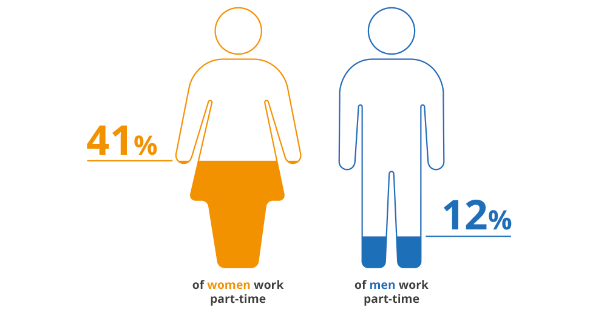

# Stories are everywhere

## Telling a story

<!-- https://clauswilke.com/dataviz/telling-a-story.html -->
<!-- https://informationisbeautiful.net/visualizations/best-in-show-whats-the-top-data-dog/ -->

Data storytelling is the practice of using data and visuals to communicate a narrative or message to an audience. It involves combining data, analysis, and storytelling techniques to create a compelling and engaging narrative that can inform, persuade, and inspire action. 

Data storytelling is necessary and good because it helps people make sense of complex data and information. By presenting data in a clear and visually appealing way, data storytelling can help people understand the meaning behind the numbers, identify patterns and trends, and gain insights into important issues and problems.

## Visualization

Good data visualization helps to convey complex information in a way that is easily understandable and accessible to a wide range of people. By presenting data in a visually appealing and intuitive way, it can help people to identify patterns, trends, and relationships that might not be immediately apparent from a simple data table or text-based analysis. 

```{r parttime, echo=FALSE, out.width="70%", fig.cap="\\label{fig:parttime}Possible gender difference in working parttime.", fig.align='center'}

```

Figure \@ref(fig:parttime) illustrates a possible gender difference in working parttime. The iconic figures are simple. The coloring is decent. The gender icons are filled by color up to the percentage numbers. It conveys the information:

> 41 % of women work part-time, whereas only 12 % of men do.

Why not just tell the numbers? An important aspect of data science is to communicate information clearly and efficiently. Complex data is made more accessible. Data visualization reveals the data.

By weaving a compelling narrative around the data, we can help our audience to understand the insights that we have discovered and why they matter. A data story can also help to make the data more memorable and emotionally resonant, which can help to further engage our audience and increase their interest in the subject matter.

## Once upon a time

Once upon a time, in a land not too far away, there were two siblings named Alex and Jamie. Alex and Jamie were very close in age and grew up in the same household with the same parents, but they had very different personalities and interests.

As they reached adulthood, Alex decided to pursue a career in finance and secured a full-time job at a large investment bank. Jamie, on the other hand, decided to focus on their passion for art and took on a part-time job as a freelance graphic designer while also working on personal creative projects.

Over time, Alex and Jamie noticed a stark difference in the way their work and career choices were perceived by society. Alex was praised for their ambition and dedication to their career, while Jamie was often questioned or criticized for not having a full-time job with benefits and stability.

Alex was also more likely to receive promotions and higher salaries, while Jamie struggled to make ends meet and was sometimes overlooked for opportunities because of their part-time status.

It became clear to Alex and Jamie that there was a gendered expectation for men to pursue full-time, high-paying careers while women were expected to prioritize caregiving or creative pursuits over financial stability.

Despite these societal expectations, Alex and Jamie continued to pursue their individual paths and support each other's choices. They hoped that someday, society would recognize the value and importance of all types of work and careers, regardless of gender or perceived societal norms.

## Man's best friend

Humans love dogs. Dogs were domesticated by humans over 15,000 years ago. They can be perfect companions for singles, for couples for families. They differ in behavior, longevity and appetite. Figure \@ref(fig:dogs) combines 6 dog characteristics in a *dog score* and compares this with the popularity of different breads. From this scatterplot the authors define four categories of dog breads, e.g. the hot dogs and overlooked treasures (similar to a [BCG matrix](https://en.wikipedia.org/wiki/Growth%E2%80%93share_matrix)). 

```{r dogs, echo=FALSE, out.width="100%", fig.cap="The Ultimate Dog Data by [informationisbeautiful](https://informationisbeautiful.net/visualizations/best-in-show-whats-the-top-data-dog/).", fig.align='center'}
knitr::include_graphics("https://infobeautiful4.s3.amazonaws.com/2014/11/IIB_Best-In-Show_1276x2.png")
```


## Less is more

Figure \@ref(fig:dogs) is an awesome data aggregate. Still, "less is more" in data visualization because too much information or visual clutter can overwhelm and confuse the audience, making it harder for them to understand the key insights and trends in the data. The complex scatterplot demands a lot of attention. 

<!-- Read more: <http://socialmediaguerilla.com/content-marketing/less-is-more-improving-the-data-ink-ratio/> -->

Here is an example of **less is more**:

<object data="https://files.speakerdeck.com/presentations/87bb9f00ec1e01308020727faa1f9e72/data-ink.pdf" width="100%" height="500">

</object>

<!-- According to the principles of **remove to improve**, decide on these design elements: -->

<!-- -   Remove backgrounds. `r torf(TRUE)` -->
<!-- -   Remove 3D effects. `r torf(TRUE)` -->
<!-- -   Remove bolding. `r torf(TRUE)` -->

The concept of data-ink ratio was introduced by data visualization expert Edward Tufte. It refers to the proportion of ink or pixels used to represent actual data in a visualization, as opposed to non-data elements like gridlines, borders, or labels.

The reason why we should care about data-ink ratio is that it directly affects the clarity and effectiveness of the visualization. The more ink or pixels we use to represent non-data elements, the less space we have to represent actual data, which can make it harder for the audience to discern the insights and trends in the data.

::: defbox
::: titeldefbox
<h2>Definition</h2>
:::

The **data-ink ratio** is the proportion of Ink that is used to present actual data compared to the total amount of ink (or pixels) used in the entire display. Good graphics should include only data-Ink. Non-Data-Ink is to be deleted everywhere where possible.
:::

## Never use pie charts

One of the main criticisms of pie charts is that they can be difficult to read and interpret accurately, especially when there are multiple slices or small differences between the sizes of the slices. It can be hard for the audience to accurately compare the sizes of the different slices, and this can lead to misinterpretation or misunderstanding of the data.

From the *note* of the documentation of `pie()` function in R it says:

```{r, eval=F}
?pie()
```

*Pie charts are a very bad way of displaying information. The eye is good at judging linear measures and bad at judging relative areas. A bar chart or dot chart is a preferable way of displaying this type of data.*

*Cleveland (1985), page 264: "Data that can be shown by pie charts always can be shown by a dot chart. This means that judgements of position along a common scale can be made instead of the less accurate angle judgements." This statement is based on the empirical investigations of Cleveland and McGill as well as investigations by perceptual psychologists.*

```{r message=FALSE, warning=FALSE, echo=F, eval=T}
# Create data for the graph.
x <- c(14, 62, 17, 53)
labels <- c("London", "New York", "Singapore", "Mumbai")
```

**Can you tell whether Singapore or London have the higher share?**

```{r message=FALSE, warning=FALSE, echo=F}
# Plot the chart.
pie(x,labels)
```

<details>

<summary>**Can you tell now?**</summary>

```{r message=FALSE, warning=FALSE}
# Plot the chart.
barplot(x, names.arg = labels)
```

</details>

<details>

<summary>Here is the R code.</summary>

```{r message=FALSE, warning=FALSE, echo=T, eval=F}
# Create data for the graph.
x <- c(14, 62, 17, 53)
labels <- c("London", "New York", "Singapore", "Mumbai")

# Plot the chart.
pie(x,labels)

# Plot the chart.
barplot(x, names.arg = labels)
```

</details>

## Grammar of Graphics

`ggplot2` is a system for declaratively creating graphics, based on **The Grammar of Graphics**. You provide the data, tell `ggplot2` how to map variables to aesthetics, what graphical primitives to use, and it takes care of the details. `ggplot2` is now over 10 years old and is used by hundreds of thousands of people to make millions of plots.

<iframe seamless width="100%" height="400" frameborder="0" src="https://pmassicotte.github.io/ivado_ggplot2_workshop_2022/#1">

</iframe>
