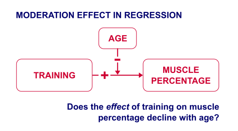

# Interaction Models 

## Motivation

<!-- https://www.researchgate.net/post/Is_there_any_different_between_control_variable_and_moderating_variable2 -->
<!-- In many contexts, the effect of one variable on another might be allowed to vary. For example, the relationship between income and mortality is nonlinear, so the effect of an additional dollar of income on mortality is different for someone earning \$20,000/year than for someone earning $100,000/year. Or maybe the relationship between income and mortality differs depending on how many years of education you have. A marginal effects plot displays the effect of X on Y for different values of Z (or X).  -->
<!-- The plot will often include confidence intervals as well. The same code will often work if there's not an explicit interaction, but you are, for example, estimating a logit model where the effect of one variable changes with the values of the others. -->
<!-- - Interactions often have poor statistical power, and you will generally need a lot of observations to tell if the effect of X on Y is different for two given different values of Z. -->
<!-- - Make sure your graph has clearly labeled axes, so readers can tell whether your y-axis is the predicted value of Y or the marginal effect of X on Y. -->
<!-- https://www.spss-tutorials.com/spss-regression-with-moderation-interaction-effect/ -->

A sports doctor routinely measures the muscle percentages of his clients. He also asks them how many hours per week they typically spend on training. Our doctor suspects that clients who train more are also more muscled. Furthermore, he thinks that the effect of training on muscularity declines with age. In multiple regression analysis, this is known as a **moderation or interaction effect** illustrated in the figure below.

<center>



</center>

In mathematical terms an interaction is an additional multiplication term:

$$ muscle = training + age + training*age  $$

## Data & Sample

<!-- <button type="button" class="btn btn-default">Show session info</button> -->

In the following we further explore the aforementioned income-age relationship and how the relationship itself may be influenced by gender and other characteristics. 

<div class="toggle"><button>Show me all the data wrangling.</button>
```{r, eval=TRUE, echo=TRUE, message=FALSE, warning=FALSE}
library(haven)
master <- read_dta("https://github.com/MarcoKuehne/marcokuehne.github.io/blob/main/data/SOEP/practice_en/practice_dataset_eng.dta?raw=true")

# The data comes with Stata labels that do not work with all tidyverse commands
library(sjlabelled)
soep <- remove_all_labels(master)

# Rename German to English variable names
library(tidyverse)
soep <- soep %>% 
  rename("Age" = "alter",
         "Income" = "einkommenj1",
         "NACE2" = "branche",
         "Persons in HH" = "anz_pers", 
         "Num_Kids" = "anz_kind",
         "Education" = "bildung",
         "Health" = "gesund_org", 
         "Satisfaction" = "lebensz_org",
         "Emp" = "erwerb") 

# Modify some variables
soep <- soep %>% 
  mutate(Single = ifelse(`Persons in HH` == 1, 1, 0),
         Kids = ifelse(Num_Kids == 0, 0, 1),
         Female = sex) %>% 
  mutate(Industry = case_when(NACE2 %in% c(1,2,3) ~ "Agriculture",
                              NACE2 %in% c(5:9) ~ "Mining",
                              NACE2 %in% c(10:32) ~ "Manufacturing",
                              NACE2 %in% c(35:38) ~ "Energy",
                              NACE2 %in% c(41:43) ~ "Construction",
                              NACE2 %in% c(50,51,52,55) ~ "Trade",
                              NACE2 %in% c(60,61,62,63,64) ~ "Transport",
                              NACE2 %in% c(65,66,67) ~ "Banking",
                              NACE2 %in%  c(70,71,72,73,74,75,80,85,90,91,92,93,95,98,99) ~ "Services",
                              TRUE ~ "Other"))

# Round annual income to two digits
soep <- soep %>% mutate(Income = round(Income, 2))

# Build the estimation sample based on the topic
soep <- soep %>% 
  filter(Emp == 1) %>% 
  filter(Age <= 65) %>% 
  filter(Income > 1) %>% 
  filter(syear == 2019)

# Conduct a complete case analysis
soep <- soep %>% filter(complete.cases(.))
```
</div>

The `datasummary()` function from `modelsummary` package provides a good overview for clean, selected variables. 

```{r, eval=TRUE, echo=TRUE, message=FALSE, warning=FALSE}
library(modelsummary)
soep %>%
  dplyr::select(Income, Age, Kids, Female, Satisfaction) %>%
  datasummary_skim()
```

The average annual income in this sample is `r format(round(mean(soep$Income),0), scientific=FALSE)`. Notice that the  income is left skewed whereas life satisfaction is skewed to the right. As expected, most people earn a low or average income and there are several extreme high incomes at the right. On the other hand, most people are on average pretty satisfied with their lifes in general. The mean of a dummy variables is the share of people with the characteristic coded with 1, i.e. about `r round(mean(soep$Kids),1)*100` % of the people have kids. In the following, binary dummy variables are coded as factors. 

```{r, eval=TRUE, echo=TRUE, message=FALSE, warning=FALSE}
# Explicitly code factor variables
soep <- soep %>% 
  mutate(Female = factor(Female),
         Kids = factor(Kids))
```

## Throwback Parallel Slopes 

Simple regression is very similar to the correlation between two variables. A multiple regression with one continuous and one dummy variable is called a *parallel slopes* model. The data looks like this:

```{r message=FALSE, warning=FALSE, echo=FALSE, eval=TRUE}
options(scipen=10000)
library(ggplot2)
library(moderndive)
ggplot(soep, aes(x=Age, y=Income, color=Female)) +
  geom_point() +
  geom_parallel_slopes(se=FALSE, size=2) +
  labs(title="Income versus Age by Gender.") +
  theme(legend.position = "none") + theme_minimal()
```

```{r message=FALSE, warning=FALSE, echo=FALSE, eval=TRUE}
simple <- lm(Income ~ Age, data=soep)
multiple <- lm(Income ~ Age + Female, data=soep)
```

Conclusion from Parallel Slopes: The *fundamental truth* is that the effect of age on income is identical across gender (i.e. for males and females). Males and female are equipped (by nature, for some reason) with a different starting annual income on average. -- Convinced?

## Regression with Moderators
<!-- https://www.econometrics-with-r.org/8-3-interactions-between-independent-variables.html -->

In the following we consider all possible kinds of two-way interactions (between two variables). Higher-order interaction might be useful under special conditions, e.g. in a study where the effect of a new drug depends on the patient's age and gender. 

An interaction can be coded implicitly or explicitly in R.

<div class="toggle"><button>Show me the coding.</button>

```{r}
# implicit coding, that automatically extends
lm1 <- lm(mpg ~ vs*am, data=mtcars)
# explicit coding, each single term and their interaction
lm2 <- lm(mpg ~ vs + am + vs:am, data=mtcars)
# only use the interaction term?
lm3 <- lm(mpg ~ vs:am, data=mtcars)

modelsummary(title = 'Coding Interaction in R.',
             list("Version 1" = lm1, 
                  "Version 2" = lm2,
                  "Version 3" = lm3), 
             gof_omit = 'R2|AIC|BIC|RMSE|Log.Lik.|F')
```
The single terms `vs` and `am` are sometimes called the *main effects*. 

</div>

### Dummy \* Dummy
<!-- https://www.theanalysisfactor.com/interaction-dummy-variables-in-linear-regression/ -->
<!-- https://cran.r-project.org/web/packages/interactions/vignettes/interactions.html -->
<!-- Categorical by categorical interactions: All the tools described here require at least one variable to be continuous. A separate vignette describes cat_plot, which handles the plotting of interactions in which all the focal predictors are categorical variables. -->

We estimate how income depends on having kids and being female.

```{r}
interact1 <- lm(Income ~ Kids*Female, data=soep)
modelsummary(title = 'Interaction Model 1.',
             list("Income" = interact1), 
             gof_omit = 'R2|AIC|BIC|RMSE|Log.Lik.|F')
```

We plot the interaction with via `cat_plot()` from the `interactions` package. This interaction dedicated package makes visualization easy.

```{r}
library(interactions)
cat_plot(interact1, pred = Kids, modx = Female)
```

This graph suggests that men earn more than women. Men with kids earn more than men without kids. The kids-effect is reversed for women, which report higher incomes when they do not have kids.

### Categorical \* Dummy

We estimate how income depends on working in different industries and being female.

```{r}
interact2 <- lm(Income ~ Industry*Female, data=soep)

library(broom)
library(knitr)

# tidy(interact2) %>% 
#   select(term, estimate, std.error) %>% 
#   #filter(! is.na(estimate)) %>% 
#   kable(digits=3)

# modelsummary(title = 'Interaction Model 2.',
#              list("Income" = interact2), 
#              gof_omit = 'R2|AIC|BIC|RMSE|Log.Lik.|F')

parts = 2 ## multi-column parts to display alongside

tidy(interact2) |>
  dplyr::select(term, coefficient = estimate) |>
  mutate(part = rep(1:parts, each = ceiling(n()/parts), length.out = n()),
         row_index = rep(1:ceiling(n()/parts), length.out = n())
         ) |>
  split(~ part) |>
  Reduce(f = \(x, y) x |> select(-part) |> left_join(y, by = 'row_index')) |>
  dplyr::select(-c(row_index, part)) |>
  kable()
```

```{r}
# The function can be modified by ggplot commands.
cat_plot(interact2, pred = Industry, modx = Female) +
  theme(axis.text.x = element_text(angle = 90, vjust = 0.5, hjust=1))
```

### Continuous \* Dummy
<!-- https://r4ds.had.co.nz/model-basics.html#interactions-continuous-and-categorical -->
<!-- https://moderndive.com/6-multiple-regression.html#model4interactiontable -->
<!-- https://www.econometrics-with-r.org/8-3-interactions-between-independent-variables.html -->
<!-- There are 3 possibilities of effects in a continuous-dummy interaction -->

Note that R automatically adds main effects if you use multiplication operator:

Thus $$ height * female $$

translates to

$$ height + female + height*female $$

```{r}
interact3 <- lm(Income ~ Age*Female, data=soep)
modelsummary(title = 'Interaction Model 2.',
             list("Income" = interact3), 
             gof_omit = 'R2|AIC|BIC|RMSE|Log.Lik.|F')
```

<!-- https://cran.r-project.org/web/packages/interactions/vignettes/interactions.html -->
The visualization for non-parallel slopes looks like this:

```{r warning=FALSE}
interact_plot(interact3, pred = Age, modx = Female,
              main.title = "Each group has a different slope.")
```

:::: {.challenge}
::: {.titelchallenge}
<h2> Conclusion </h2>
:::
The **fundamental truth** is that the effect of age on income is positive but not identical between males and females. Men and women at the exact same age earn different annual incomes and the gap widens over time. There is **effect heterogeneity**.
::::

There are two more rather uncommon combination in which one of the main effects is dropped. Graphically, the result is two lines with same intercept and different slopes. 

```{r}
interact3b <- lm(Income ~ Age + Age:Female, data=soep)

interact_plot(interact3b, pred = Age, modx = Female) +
  scale_x_continuous(limits = c(0, 65)) +
  geom_smooth(method = "lm", se = FALSE, fullrange = TRUE)

# modelsummary(title = 'Interaction Model 2.',
#              list("Income" = interact3b,
#                   "Income" = interact3c), 
#              gof_omit = 'R2|AIC|BIC|RMSE|Log.Lik.|F')
```

<!-- Now it is no longer a parallel slopes model. A different slope is equivalent to a different effect of height on weight for the two genders.  -->

### Continuous \* Continuous
<!-- https://r4ds.had.co.nz/model-basics.html#interactions-two-continuous -->
<!-- https://www.theanalysisfactor.com/3-tips-interpreting-moderation/ -->

```{r}
interact4 <- lm(Income ~ Age*Satisfaction, data=soep)
interact4
```

The interaction of two continuous variables is harder to interpret. There are conventions to help you choose the best values of the continuous moderator for plotting predicted values. But these conventions don't always work in every situation. For example, one convention suggested by Cohen and Cohen and popularized by Aiken and West is to use three values of the moderator: the mean, the value one standard deviation above, and the value one standard deviation below the mean. This is what interact_plot() does by default.

```{r}
interact_plot(interact4, pred = Age, modx = Satisfaction)
```

This shows you that interaction between two continuous variables works basically the same way as for a categorical and continuous variable. An interaction says that there's not a fixed offset: you need to consider both values of x1 and x2 simultaneously in order to predict y.

You can see that even with just two continuous variables, coming up with good visualizations are hard. But that's reasonable: you shouldn't expect it will be easy to understand how three or more variables simultaneously interact! But again, we're saved a little because we're using models for exploration, and you can gradually build up your model over time. The model doesn't have to be perfect, it just has to help you reveal a little more about your data.

## Model Comparison 

How to decide if the model with interaction is better than the model without interaction?

```{r}
library(gt)

multiple3 <- lm(Income ~ Age + Female, data=soep)
multiple4 <- lm(Income ~ Age + Satisfaction, data=soep)

modelsummary(title = 'Comparison',
             list("Income" = multiple3,
                  "Income" = interact3,
                  "Income" = multiple4,
                  "Income" = interact4), 
             gof_omit = 'R2|AIC|BIC|RMSE|Log.Lik.',
             output = "gt") %>% 
  # column labels
  tab_spanner(label = 'Interaction', columns = c(3,5)) 
```   
        
        
             
<script>
  $(".toggle").click(function() {
    $(this).toggleClass("open");
  });
</script>


