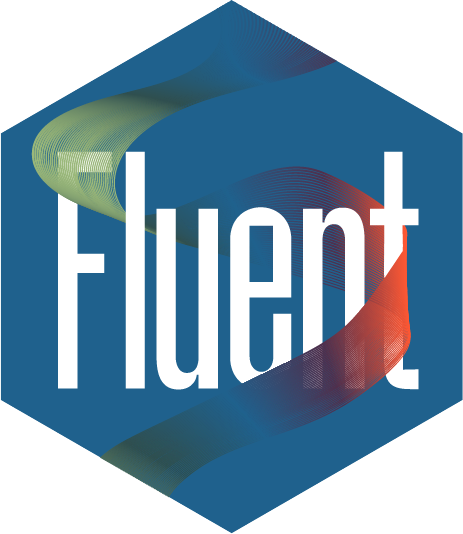
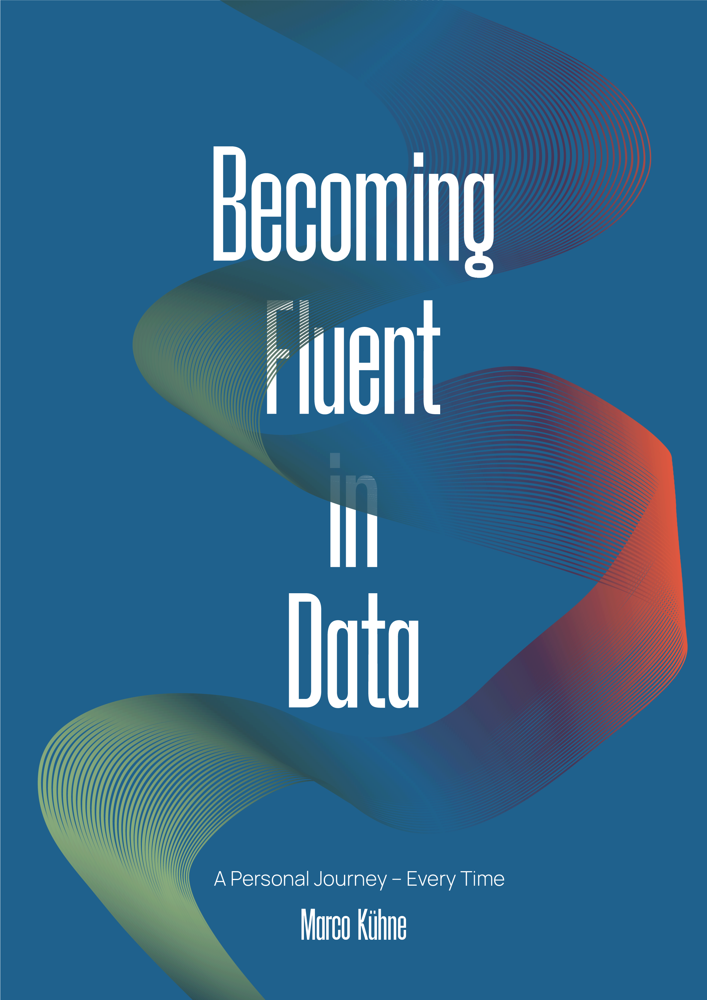

---
# =========================================================================
#  BOOK METADATA
# =========================================================================
title: "Becoming Fluent in Data"
subtitle: "A Personal Journey – Every Time."
author: "Marco Kühne"
date: "`r Sys.Date()`"
description: "A guide to becoming fluent in data."
site: bookdown::bookdown_site

# Absolute URLs: social-media scrapers cannot resolve a relative
# "/images/Cover.png", which is why link previews never showed the cover.
url: https://becoming-fluent-in-data.com
cover-image: https://becoming-fluent-in-data.com/images/Cover.png
favicon: "images/Logo.ico"

# Adds "Edit this page" / "View source" buttons to the toolbar.
github-repo: MarcoKuehne/marcokuehne.github.io

# =========================================================================
#  BIBLIOGRAPHY
# =========================================================================
bibliography: references.bib
biblio-style: apalike
link-citations: yes
csl: https://www.zotero.org/styles/apa
lang: en-GB

# =========================================================================
#  PDF / EPUB ONLY  — ignored by gitbook, needed if you ever enable downloads
# =========================================================================
documentclass: book
always_allow_html: yes

# =========================================================================
#  STYLESHEETS
#  css/toc.css and css/hero.css are deliberately absent: toc.css styles #TOC,
#  which gitbook never emits (its sidebar is .book-summary), and hero.css
#  belongs to the unused hero.html.
# =========================================================================
css: [www/webex.css, css/style.css, css/boxes.css]

# =========================================================================
#  OUTPUT
#  This block overrides _output.yml completely — keep settings here only.
# =========================================================================
output:
  bookdown::gitbook:
    md_extensions: -smart      # keep straight quotes, do not "smarten" them
    split_by: section          # NOTE: only after the chapter restructure.
    toc_depth: 3               # Until then keep chapter / omit toc_depth.
    split_bib: false           # one bibliography page, not one per chapter
    highlight: tango
    config:
      toc:
        before: |
          <li><a href="https://becoming-fluent-in-data.com/">Becoming Fluent in Data</a></li>
          <li><p class="aligncenter"></p></li>
        after: |
          <li><a href="https://marco-kuehne.com/" target="_blank">Visit my personal page</a></li>
        collapse: section
        scroll_highlight: false
      download: null           # no PDF/EPUB buttons. To enable: [pdf, epub]
      sharing: null            # removes the share button entirely
    includes:
      in_header:   [hypothesis.html, google_analytics.html]
      before_body: [top_message.html]
      after_body:  www/webex.js
---

```{r setup, include=FALSE}
knitr::opts_chunk$set(
  comment = "#>",
  echo = TRUE,
  eval = TRUE,
  warning = FALSE,
  message = FALSE,
  collapse = TRUE,
  cache = FALSE,
  tut = FALSE,
  fig.width = 6
)

if (!requireNamespace("webexercises")) {
  stop(
    "You must have the 'webexercises' package installed to knit to HTML.\n",
    "Install it with install.packages(\"webexercises\")."
  )
} else {
  library("webexercises")
}

# ---------------------------------------------------------------------------
#  BOOK-WIDE PACKAGES
#  `new_session: no` in _bookdown.yml means every chapter is knitted in this
#  same R session, so anything attached here stays attached for the whole book.
#  Rule: a package belongs here when three or more chapters use it, or when it
#  powers the book itself. Everything else is attached in the one chapter that
#  needs it, so that a `library()` call inside a chapter always carries
#  information. Keep this list in sync with Imports: in DESCRIPTION.
# ---------------------------------------------------------------------------

# The book itself
library("tippy")          # tooltips

# Data handling and graphics
library("tidyverse")      # ggplot2, dplyr, tidyr, readr, purrr, tibble, stringr, forcats
library("haven")          # SPSS/Stata/SAS import - the SOEP files
library("sjlabelled")     # labelled survey variables
library("scales")         # axis and label formatting

# Tables
library("knitr")          # kable(), include_graphics(), opts_chunk
library("kableExtra")     # kable styling
library("modelsummary")   # regression and summary tables
library("DT")             # searchable HTML tables
```

# (PART) Introduction {#part-introduction -}

# Preface {#preface -}

<center></center>

### From Dust and dark {#from-dust-and-dark -}

A dusty lecture hall. Light cuts through the darkness from one side of the room. Only a few of the many seats are occupied, and the small groups of students have left generous distances between themselves and the lecturer.

At the front, an imposing but competent instructor explains how to analyse memory and cognition experiments using boxplots, *t*-tests, and the like—in that statistical software. In front of me sits my creaky, slow, but loyal laptop.

That was my first encounter with **R** during my undergraduate psychology studies.

It was not love at first sight. R looked austere, the lecture hall looked dusty, and neither the code nor the statistical methods immediately revealed their beauty. But something had begun. Over time, R became a tool for asking questions, inspecting evidence, teaching methods, and producing this book.

The times were changing—and so was I.

<br>

<center>Are you `r fitb("r", ignore_case = TRUE)` eady to join the journey?</center>

<br>

### Learning like a dolphin swims {#learning-like-a-dolphin-swims -}

How can we learn statistical methods without either remaining at the surface or becoming lost in an ocean of formulas and technical details?

A metaphor that came to my mind only recently is to learn **like a dolphin swims**.

At first, I was not sure whether we should watch the dolphin or whether we are the dolphin. I now think that **we are the dolphin**.

A dolphin can dive deep into the ocean. It can move through a vast world that remains invisible from above. But it cannot stay there forever. It must return to the surface to breathe.

Learning methods can follow the same movement.

At the surface, we try to see the larger idea:

- What is the question?
- What is the method trying to do?
- Why might it be useful?
- How is it connected to something we already know?

Then we dive. We encounter data, assumptions, formulas, estimators, models, code, and technical details. This underwater world can seem almost endless, and serious analysis requires us to enter it.

But we should not live there permanently.

Someone who remains only in the depths may know every technical distinction while losing sight of the original question. It is a statistical version of the ivory tower—only built at the bottom of the sea. Someone who remains only above the water may collect attractive graphs, convenient commands, and isolated facts without understanding what happens underneath.

The dolphin connects both worlds.

We dive into a formula and return to an example. We inspect an R result and return to the substantive question. We learn a new method and then look beyond its boundaries to see how it connects to other methods.

Resurfacing is not a failure to understand. It is part of understanding.

> **Learn like a dolphin swims: move between the surface and the depths, breathe, look around, and dive again.**

### Teach – Learn – Repeat {#teach-learn-repeat -}

A second principle behind this book is *learning by teaching*.

Unlike the dolphin, this is not a metaphor that I invented. It is an established educational approach, and it gave a name to something I had experienced for years.

When I needed to understand mathematics as a student, I became the head of a study group. Later, I worked as a private tutor, a student assistant, and a university instructor. Teaching quantitative methods for many years gave me repeated opportunities to try different explanations, examples, visualisations, and sequences—and to observe where people followed, where they became confused, and what helped an idea become clearer.

Still, trying to teach something is one of the best ways I know to learn it myself.

Not everyone has the opportunity to teach a university course. Fortunately, learning by teaching does not require a lecture hall.

Give someone private tutoring. Explain a method to a friend or colleague. Write down how an analysis works. Comment your code so another person can follow it. Prepare a presentation, create an example, contribute to an explanation, or write a book.

Trying to explain something exposes the gaps in our own understanding. We notice which steps we have silently skipped, which terms remain vague, and which connections we have only assumed. Then we know where we need to dive again.

Teaching is therefore not only something that follows learning.

> **Teaching can itself be a way of learning.**

Writing this book follows the same idea. It forces me to pinpoint what I know, what I only think I know, and what I still need to learn. In that sense, the book is not the final product of a completed learning process. It is part of the process.

> I could feel that econometrics was indispensable, and yet I was missing something. But what? It was a theory of causality […]. <b>So, desperate, I did what I always do when I want to learn something new — I developed a course on causality to force myself to learn all the things I didn’t know.</b>
>
> `r tufte::quote_footer('@cunningham2021causal')`

This project has helped me learn more about R, RStudio, R Markdown, Bookdown, HTML and CSS, Git and GitHub, empirical research, causal inference, statistics, mathematics, frustration tolerance—and fun.

*Learning by teaching* is associated with Jean-Pol Martin. Who is it? `r mcq(c("Jimmy Wales", "Linus Torvalds", answer = "Jean-Pol Martin", "Richard E. Pattis"))`

### Doing something meaningful with data {#doing-something-meaningful-with-data -}

The dolphin metaphor and *learning by teaching* describe how I approach learning. A third idea is different: it is a personal aspiration for what we do with the things we learn.

> **Do something useful and meaningful with data.**

Academic work requires specialisation. Teachers, researchers, and university instructors naturally spend a great deal of time inside their subjects, methods, institutions, and professional discussions. That concentration can produce deep knowledge. It can also create distance from the world outside academia.

I have seen the academic ivory tower often enough to know how easily a real question can disappear behind a method. We may become fascinated by increasingly refined models and forget the people represented by the data. We may teach procedures without asking when they are useful, whose decisions they inform, or what consequences they may have.

It cannot hurt to synchronise regularly with the world beyond academia.

Why are we analysing these data? Which real problem are we trying to understand? Could the analysis improve a decision, reveal an inequality, evaluate a policy, support education, or make an important issue more visible? Who might benefit from the knowledge—and who might remain invisible?

Not every analysis must save the world. Technical practice, theoretical questions, curiosity, and playful exploration all have value. Coding can simply be fun.

But data analysis should not exist only to produce more data analysis.

> **Data analysis should solve problems and serve people and society.**

These three ideas accompany the journey through this book:

1. **Move between overview and depth.**
2. **Learn by explaining to others.**
3. **Use data to do something meaningful.**

### About this book {#about-this-book -}

*Becoming Fluent in Data* is an open and evolving introduction to working, thinking, and communicating with data.

It is not intended to be a catalogue of isolated commands or statistical procedures. Its aim is to help readers move between real questions, data, visualisations, formulas, models, code, and interpretation—and to recognise the connections among them.

#### Data literacy and data fluency {-}

Numbers do not simply appear. Someone decided what to measure, how to measure it, which observations to include, how to process them, and how to present the result.

Do not take numbers for granted. There is a long journey behind them.

:::: {.defbox}

::: {.titeldefbox}
<h2>Definition</h2>
:::

**Data literacy** is the ability to read, understand, create, and communicate data as information.

**Data fluency** goes a step further: it is the ability to move confidently between substantive questions, data, visualisations, code, models, and conclusions.

::::

The book aims to enable readers not only to conduct their own analyses, but also to understand and critically examine the data work of others. That may mean checking a data source, reproducing a calculation, questioning a measurement, investigating an assumption, or forming an independent interpretation.

You do not need to think of yourself as a “computer person” or a “math person.” Code can become another way of approaching whatever already interests you: education, inequality, politics, health, music, sport, travel, gardening, or everyday life.

And not to forget: coding can be fun.

#### Who this book is for {-}

This project is for people who want to become more confident in working with data.

It can accompany students encountering R and quantitative methods for the first time. It can also help readers who already know individual procedures but want to understand how those procedures are related and when they are useful.

For instructors, *Becoming Fluent in Data* is an open educational resource. Chapters, explanations, examples, exercises, data, and visual materials can be selected and combined for different teaching and learning settings.

No previous experience with R is required for the introductory material. Later sections gradually move towards more complex data structures, statistical models, mathematical notation, and methodological questions.

#### How to read this book {-}

You do not need to read every page at the same depth.

On a first journey, stay near the surface. Follow the questions, examples, visualisations, and main conclusions. Try to understand what a method does before worrying about every technical detail.

On another journey, dive deeper. Run the code. Change the data. Inspect the output. Work through a formula. Compare alternative models. Ask what an assumption contributes to the conclusion.

The book has a general direction, but it is also modular. You can read it from beginning to end, use one part for a course, or return to a particular section when you encounter a question in your own work.

Some ideas will return more than once. They may first appear as an intuition, later as code, then as a formula, and finally as a special case of a more general model. This repetition is intentional.

The important movement is not always forward.

Sometimes we need to resurface, regain orientation, and dive again.

#### What to expect {-}

The book repeatedly connects four forms of understanding:

1. **Questions and stories** give us a reason to care.
2. **Data and visualisations** make patterns visible.
3. **Models and formulas** describe those patterns more precisely.
4. **Code** makes the analysis transparent, reproducible, and changeable.

The chapters begin with foundational questions about data, measurement, data structures, and description. They then move towards comparison, variation, relationships, statistical models, uncertainty, and more advanced questions of measurement and explanation.

The exact route continues to evolve. The recurring aim, however, remains the same: do not treat methods as isolated islands. Look for the shared ideas, empirical comparisons, and mathematical structures that connect them.

#### Open, modular, and evolving {-}

*Becoming Fluent in Data* is designed as an open educational resource.

The book is freely accessible, and its complete source code is available on [GitHub](https://github.com/MarcoKuehne/marcokuehne.github.io). The project also includes reusable datasets and materials that can support different teaching and learning scenarios.

Individual chapters, examples, exercises, data files, and visual materials can be used independently or combined into a larger course. Educational videos may also serve as standalone introductions to selected concepts.

The project is licensed under the Creative Commons Attribution–NonCommercial–ShareAlike 4.0 International licence. It remains a work in progress, and feedback, corrections, and new perspectives are welcome.

#### Structure and visual language {-}

The book uses recurring visual elements to help readers recognise what kind of encounter lies ahead. These boxes are not merely decoration. They offer orientation at different depths of the journey.

:::: {.defbox}

::: {.titeldefbox}
<h2>Definition</h2>
:::

A **definition** introduces the meaning of an important term or concept.

::::

:::: {.amazing}

::: {.titelamazing}
<h2>Amazing Fact</h2>
:::

An **amazing fact** highlights a surprising, memorable, or especially useful connection.

::::

:::: {.reading}

::: {.titelreading}
<h2>Reading</h2>
:::

A **reading** points to a valuable resource for another explanation or a deeper dive.

::::

:::: {.challenge}

::: {.titelchallenge}
<h2>Your Turn</h2>
:::

**Your turn** invites you to calculate, code, interpret, explain, or explore something yourself.

::::

:::: {.dedicated}

::: {.titeldedicated}
<h2>Truly Dedicated</h2>
:::

A **Truly Dedicated** section descends further into derivations, qualifications, extensions, or technical details. You may skip it on a first reading and return when you are ready for a deeper dive.

::::

Underlined text may contain a tooltip. Move the cursor over <u id="tippy">this example</u>.

```{r idx-structure-visual-language, echo=FALSE}
tippy::tippy_this(
  elementId = "tippy",
  tooltip = "Underlined text can provide a short explanation without interrupting the main text."
)
```

The `webexercises` package adds small interactive questions for `r mcq(c("ballroom dancing", answer = "self-guided learning", "vegetarian cooking", "stamp collecting"))`.

What is the Answer to the Ultimate Question of Life, the Universe, and Everything? `r fitb(42)`

The web annotation tool [Hypothes.is](https://web.hypothes.is/) can be used to highlight passages and add annotations to the online book.

These elements are invitations, not obligations. Stay at the surface when you need orientation. Dive when curiosity or necessity takes you deeper. Then resurface, explain what you found, and connect it to the world beyond the book.

### About the author {#about-the-author -}

:::::: {.columns}

::: {.column width="20%" data-latex="{0.20\textwidth}"}
```{r idx-about-author, echo=FALSE, out.width="90%", fig.align="center"}
knitr::include_graphics(path = "images/Marco-scaled.jpg")
```
:::

::: {.column width="5%" data-latex="{0.05\textwidth}"}
\ 
<!-- Empty Div serving as a column separator -->
:::

::: {.column width="75%" data-latex="{0.75\textwidth}"}
Welcome! My name is **Marco Kühne**, and Marco is the name I respond to.

My work and interests lie at the intersection of data analysis, quantitative social science, research design, statistical software, and education. I have taught quantitative methods and R in different settings for many years.

This book grew from courses, notes, questions, mistakes, discussions, and repeated attempts to find clearer explanations. It is both a teaching resource and an ongoing learning project.

- Web: <https://marco-kuehne.com/>
- GitHub: <https://github.com/MarcoKuehne>
:::

::::::
